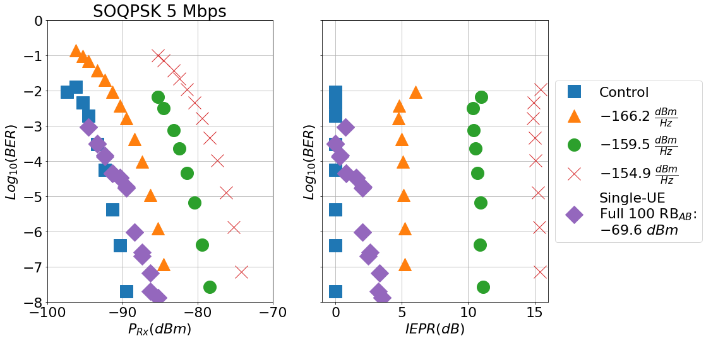
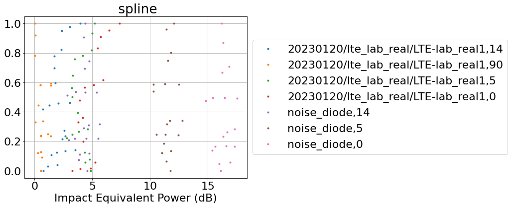
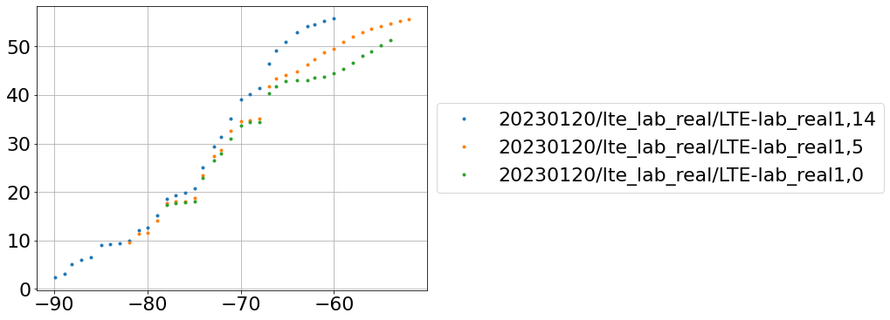
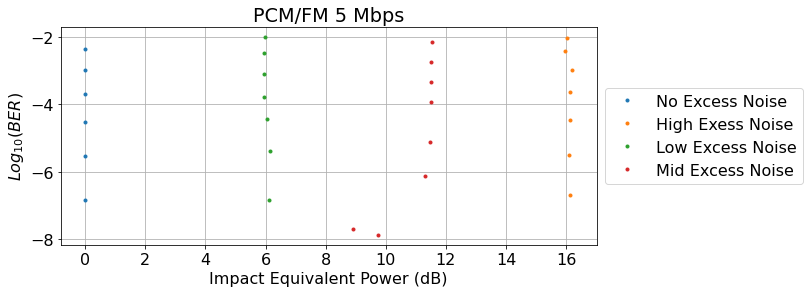
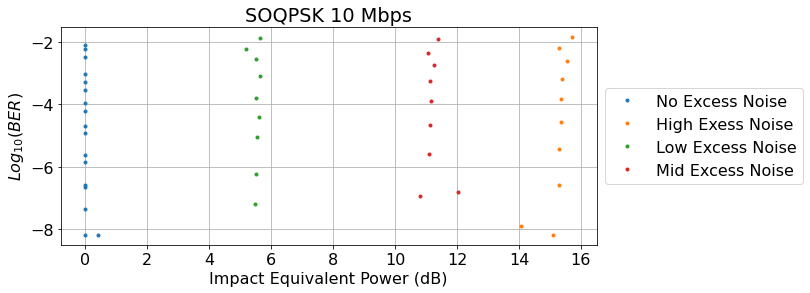
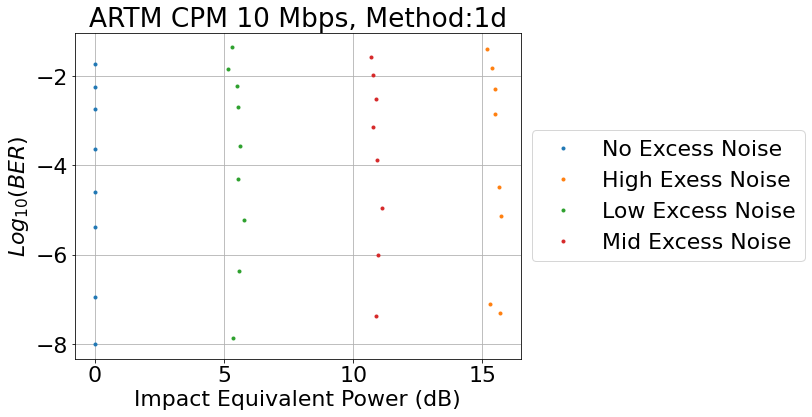
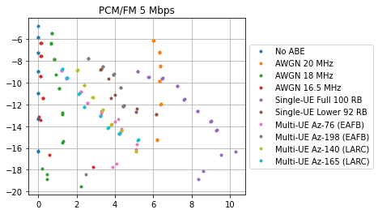
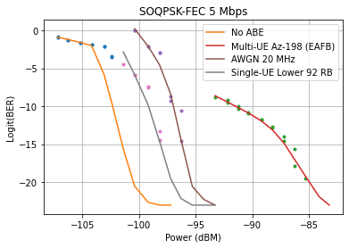

## EMC 2024 Paper
Currently the idea is to transform the thermally equivalent power paper written for, but rejected by MILCOM 2023, into a paper for EMC 2024. The idea is to create a KPI independent way of characterizing the effective power or noise floor rise in a rx system. 

## Imports
<hr/>


```python
import pandas as pd
import matplotlib.pyplot as plt
from matplotlib.ticker import (AutoMinorLocator, MultipleLocator)

import numpy as np
import json
import os
import re
import datetime
from scipy import interpolate
import seaborn as sns
import scipy.optimize
from sklearn.gaussian_process import GaussianProcessRegressor
from sklearn.gaussian_process.kernels import RBF
from scipy.interpolate import make_smoothing_spline
import statsmodels.api as sm
from scipy import signal
from skmisc.loess import loess


```


```python
def quality_factor(kpi_array,flip=True):
    """Transforms a kpi list into a quality factor -> (KPI - KPImin)/(KPImax-KPImin)"""
    max_kpi = max(kpi_array)
    min_kpi = min(kpi_array)
    if flip:
        return (kpi_array-max_kpi)/(min_kpi-max_kpi)
    else:
        return (kpi_array-min_kpi)/(max_kpi-min_kpi)
def quality_figure(kpi_array):
    """ Returns a quality figure in log units"""
    return 10*np.log10(quality_factor(kpi_array))
    
```


```python
def logit(x):
    return np.log(x / (1 - x))


def logistic(x):
    return 1 / (1 + np.exp(-x))

def loess_regression_BER(x, y, domain):
    """Uses the lowess regression on a BER data set"""
    num_attempts = 0
    # Get rid of Zero BER
    y = y.apply(lambda val: val if val > 0 else 1e-10)
    # Transform to logit units
    y = logit(y)

    span_value = 0.65
    y_pred = None
    while num_attempts < 7:
        try:
            num_attempts += 1
            lo = loess(x, y, span=span_value, p=1, family='gaussian', degree=1, normalize=False)
            lo.fit()
            pred = lo.predict(domain, stderror=True)
            y_pred = pd.Series(logistic(np.array(pred.values)))
            y_pred = y_pred.apply(lambda val: val if val > 1e-10 else 1e-10)
        except ValueError:
            span_value += 0.05
    if y_pred is not None and 1e-8 < y_pred.max() < 1e-4:
        domain_extrap = pd.Series(np.linspace(domain.min() - 4, domain.min(), 100))
        f = np.poly1d(np.polyfit(domain[:20], np.log10(y_pred[:20]), 1))
        y_pred_extrap = pd.Series(10 ** f(domain_extrap))
        y_pred_extrap_inds = y_pred_extrap.index[y_pred_extrap < 1e-3].tolist()
        y_pred_extrap = y_pred_extrap[y_pred_extrap_inds]
        domain_extrap = domain_extrap[y_pred_extrap_inds]
        return y_pred, y_pred_extrap, domain_extrap
    elif y_pred is not None and y_pred.max() < 1e-9:
        domain_extrap = np.linspace(domain.min() - 1, domain.min(), 50)
        f = np.poly1d(np.polyfit([domain.min() - 1, domain.min()], np.log10([0.5e-1, y_pred[0]]), 1))
        y_pred_extrap = pd.Series(10 ** f(domain_extrap))
        y_pred_extrap_inds = y_pred_extrap.index[y_pred_extrap < 1e-3].tolist()
        y_pred_extrap = y_pred_extrap[y_pred_extrap_inds]
        domain_extrap = domain_extrap[y_pred_extrap_inds]
        return y_pred, y_pred_extrap, domain_extrap
    return y_pred, None, None

```


```python
def least_squares_fit(function,xdata,ydata,initial_parameters):
    """Returns a parameter list after fitting the data x_data,y_data
    with the function in the form of f(parameter_list,x)"""
    error_function=lambda a, xdata, ydata:function(a,xdata)-ydata
    a,success=scipy.optimize.leastsq(error_function, initial_parameters,args=(np.array(xdata),np.array(ydata)))
    return a
def reverse_regressor(x_data,y_data,new_y_data,method="lowess",**options):
    """reverse_regressor returns a series of new_x_data points given observed x_data, y_data and the desired 
    new_y_data. This function is intended as a wrapper to create a clean interface to the large number of interpolation
    possibilites.
    
    Current methods are lowess,loess, 1d, gpr and spline. 
    *********************************************************************************************
    refs: https://docs.scipy.org/doc/scipy/reference/generated/scipy.interpolate.interp1d.html, options for kind are
    ‘linear’, ‘nearest’, ‘nearest-up’, ‘zero’, ‘slinear’, 
    ‘quadratic’, ‘cubic’, ‘previous’, or ‘next’. ‘zero’, ‘slinear’, ‘quadratic’ and ‘cubic’
    ****************************************************************************************
    https://www.statsmodels.org/dev/generated/statsmodels.nonparametric.smoothers_lowess.lowess.html
    ***********************************************************************************************
    https://has2k1.github.io/scikit-misc/stable/index.html
    ******************************************************
    https://scikit-learn.org/stable/modules/gaussian_process.html
    ***************************************************************
    https://docs.scipy.org/doc/scipy/tutorial/interpolate/smoothing_splines.html
    ********************************************************************************"""
    defaults = {}
    interpolation_options = {}
    for key,value in defaults.items():
        interpolation_options[key] = value
    for key, value in options.items():
        interpolation_options[key] = value
    new_x_data = None 
        
    if re.search("lowess",method,re.IGNORECASE):
        lowess_key_words = ['frac']
        lowess_options = {}
        for key,value in interpolation_options.items():
            if key in lowess_key_words:
                lowess_options[key]=value
        interpolation_result= sm.nonparametric.lowess(x_data,
                                                      y_data,
                                                      xvals = new_y_data,
                                                      **lowess_options)
        new_y_data = interpolation_result
        
    if re.search("loess",method,re.IGNORECASE):
        loess_key_words = ['p','span','family','degree','normalize']
        loess_options = {"span":0.65, "p":1, "family":'gaussian', "degree":1, "normalize":False}
        for key,value in interpolation_options.items():
            if key in loess_key_words:
                loess_options[key]=value
        lo = loess(y_data, x_data, **loess_options)
        lo.fit()
        pred = lo.predict(new_y_data, stderror=True)
        new_x_data = np.array(pred.values)
        
    if re.search("1d",method,re.IGNORECASE):
        interp1d_key_words = ["kind","axis","copy","bounds_error","fill_value","assume_sorted"]
        interp1d_options ={"fill_value":"extrapolate"}
        for key,value in interpolation_options.items():
            if key in interp1d_key_words:
                interp1d_options[key]=value
        interpolation_function = scipy.interpolate.interp1d(y_data,
                                   x_data,**interp1d_options)
        new_x_data = interpolation_function(new_y_data)
        
    elif re.search("gpr",method,re.IGNORECASE):
        gpr_key_words = ["kind","axis","copy","bounds_error","fill_value","assume_sorted"]
        gpr_options ={"kernel":1 * RBF(length_scale=1.0, length_scale_bounds=(1e-2, 1e2)),
                     "n_restarts_optimizer":9}
        for key,value in interpolation_options.items():
            if key in gpr_key_words:
                gpr_options[key]=value

        gaussian_process = GaussianProcessRegressor(**gpr_options)
        gaussian_process.fit(y_data.reshape(-1,1), x_data)
        mean_prediction, std_prediction = gaussian_process.predict(new_y_data.reshape(-1,1), return_std=True)
        new_x_data = mean_prediction
        
    elif re.search("spline",method,re.IGNORECASE):
        coordinates = zip(y_data,x_data)
        ordered_array = np.array(sorted(coordinates))        
        interpolation_function = scipy.interpolate.make_smoothing_spline(ordered_array.T[0],ordered_array.T[1])
        new_x_data = interpolation_function(new_y_data)   
    return new_x_data    

def interpolate_data(x_data,y_data,new_x_data,method="lowess",**options):
    """interpolate_data returns a series of new_y_data points given observed x_data, y_data and the desired 
    new_x_data. This function is intended as a wrapper to create a clean interface to the large number of interpolation
    possibilites. Current methods are lowess, 1d, gpr and spline. 
    *********************************************************************************************
    refs: https://docs.scipy.org/doc/scipy/reference/generated/scipy.interpolate.interp1d.html, options for kind are
    ‘linear’, ‘nearest’, ‘nearest-up’, ‘zero’, ‘slinear’, 
    ‘quadratic’, ‘cubic’, ‘previous’, or ‘next’. ‘zero’, ‘slinear’, ‘quadratic’ and ‘cubic’
    ****************************************************************************************
    https://www.statsmodels.org/dev/generated/statsmodels.nonparametric.smoothers_lowess.lowess.html
    ***********************************************************************************************
    https://scikit-learn.org/stable/modules/gaussian_process.html
    ***************************************************************
    https://docs.scipy.org/doc/scipy/tutorial/interpolate/smoothing_splines.html
    ********************************************************************************"""
    defaults = {}
    interpolation_options = {}
    for key,value in defaults.items():
        interpolation_options[key] = value
    for key, value in options.items():
        interpolation_options[key] = value
    new_y_data = None 
        
    if re.search("lowess",method,re.IGNORECASE):
        lowess_key_words = ['frac']
        lowess_options = {}
        for key,value in interpolation_options.items():
            if key in lowess_key_words:
                lowess_options[key]=value
        interpolation_result= sm.nonparametric.lowess(y_data,
                                                      x_data,
                                                      xvals = new_x_data,
                                                      **lowess_options)
        new_y_data = interpolation_result
        
            
    if re.search("loess",method,re.IGNORECASE):
        loess_key_words = ['p','span','family','degree','normalize']
        loess_options = {"span":0.65, "p":1, "family":'gaussian', "degree":1, "normalize":False}
        for key,value in interpolation_options.items():
            if key in loess_key_words:
                loess_options[key]=value
        lo = loess(x_data, y_data, **loess_options)
        lo.fit()
        pred = lo.predict(new_x_data, stderror=True)
        new_y_data = np.array(pred.values)
        
    if re.search("1d",method,re.IGNORECASE):
        interp1d_key_words = ["kind","axis","copy","bounds_error","fill_value","assume_sorted"]
        interp1d_options ={"fill_value":"extrapolate"}
        for key,value in interpolation_options.items():
            if key in interp1d_key_words:
                interp1d_options[key]=value
        interpolation_function = scipy.interpolate.interp1d(x_data,
                                   y_data,**interp1d_options)
        new_y_data = interpolation_function(new_x_data)
        
    elif re.search("gpr",method,re.IGNORECASE):
        gpr_key_words = ["kind","axis","copy","bounds_error","fill_value","assume_sorted"]
        gpr_options ={"kernel":1 * RBF(length_scale=1.0, length_scale_bounds=(1e-2, 1e2)),
                     "n_restarts_optimizer":9}
        for key,value in interpolation_options.items():
            if key in gpr_key_words:
                gpr_options[key]=value
        gaussian_process = GaussianProcessRegressor(**gpr_options)
        gaussian_process.fit(x_data.reshape(-1,1), y_data)
        mean_prediction, std_prediction = gaussian_process.predict(new_x_data.reshape(-1,1), return_std=True)
        new_y_data = mean_prediction
        
    elif re.search("spline",method,re.IGNORECASE):
        coordinates = zip(x_data,y_data)
        ordered_array = np.array(sorted(coordinates))        
        interpolation_function = scipy.interpolate.make_smoothing_spline(ordered_array.T[0],ordered_array.T[1])
        new_y_data = interpolation_function(new_x_data)
        
    return new_y_data
```


```python
def calculate_shift(interpolation_function_1,interpolation_function_2,x_data,initial_shift = 0):
    """Calculates the least squares fit that minimizes interpolation_function_1(x)-interpolation_function_2(x-shift)
    and returns shift"""
    y_data = interpolation_function_1(x_data)
    def fit_function(a,x):
        return interpolation_function_2(x-a[0])
    shift = least_squares_fit(fit_function,x_data,y_data,initial_parameters = [initial_shift])
    return shift

def calculate_extreme_shift(interpolation_function_1,interpolation_function_2,x_1_data,x_2_data):
    "Calculates a shift for two interpolation functions that do not overlap in x"
    initial_shift_guess = np.mean(x_2_data)-np.mean(x_1_data)
    n_points = 2000
    x_1_min = min(x_1_data)
    x_1_max = max(x_1_data)
    x_2_min = min(x_2_data)
    x_2_max = max(x_2_data)
    x_min = max(x_1_min,x_2_min-initial_shift_guess)
    x_max = min(x_1_max,x_2_max-initial_shift_guess)
    new_x_axis = np.linspace(x_min,x_max,n_points)
    delta_x = new_x_axis[1]-new_x_axis[0]
    # pad the data
    y1 = []
    y2 = []
    for x in new_x_axis:
        try:
            y1.append(interpolation_function_1(x))
        except:
            y1.append(0)
        try:
            y2.append(interpolation_function_2(x+initial_shift_guess))
        except:
            y2.append(0)
    y1 = np.array(y1)
    y2 = np.array(y2)
    plt.plot(new_x_axis,y1,'.k',label="Padded Function 1")
    plt.plot(new_x_axis,y2,'.r',label="Padded Function 2")
    plt.legend()
    plt.grid()
    plt.show()
    plt.close()
    correlation = signal.correlate(y1,y2, mode="full")
#     ax = plt.gca()
#     twin_ax = ax.twinx()
#     twin_ax.plot(new_x_axis,correlation)

    lags = signal.correlation_lags(y1.size, y2.size, mode="full")
    lag = lags[np.argmax(correlation)]

    shift = -1*delta_x*lag
    shift2 = calculate_shift(interpolation_function_1,interpolation_function_2,new_x_axis)
    plt.plot(new_x_axis,y1,'.k',label="Function 1")
    plt.plot(new_x_axis+shift2,interpolation_function_2(new_x_axis),'.r',label=f"Shifted Function 2 :{shift2}")
    plt.plot(new_x_axis+shift,interpolation_function_2(new_x_axis),'.g',label=f"Shifted Function 2-correlate :{shift}")

    plt.legend()
    plt.grid()
    plt.show()
    plt.close()
    plt.plot(delta_x*lags,correlation)
    plt.vlines([initial_shift_guess,shift,shift2],min(correlation),max(correlation),color = "r")

    plt.grid()
    plt.show()
    plt.close()
    total_shift = lag*delta_x-initial_shift_guess
#     shape1 = np.column_stack((new_x_axis, y1))
#     shape2 = np.column_stack((new_x_axis, y2))

#     similarity = shape_similarity(shape1, shape2)
    print(f"Parameters from calculate_extreme_shift ->\initial guess {initial_shift_guess}\ntotal shift:{total_shift}\nshift2:{shift2}\nmax arg:{np.argmax(correlation)}\nlag:{lag}\nshift:{shift}\nx_min:{x_min}\nx_max:{x_max}")
    return total_shift

def sort_by_x(x_data,y_data):
    """Given two arrays or lists sorts by x and returns both arrays in order ordered_x_data,ordered_y_data)"""
    coordinates = zip(x_data,y_data)
    ordered_array = np.array(sorted(coordinates))        
    new_x_data = ordered_array.T[0]
    new_y_data = ordered_array.T[1]
    return new_x_data,new_y_data

```

## Data Ingest
<hr/>

## Inverse Regression Versus Reverse Regression


```python
plt.rcParams.update({'font.size': 22,'figure.figsize': [10, 6]})

x_values = np.linspace(0,26,100)
y_values = np.linspace(0,0,100)

plt.plot(x_values,y_values,"k--")
plt.plot([0,0,0,0,0],[.2,.4,.6,.8,.1],"bs")
plt.plot([3,3.1,2.9,3.4,2.8],[.2,.4,.6,.8,.1],"rx",markersize=20)
plt.plot([10,10.2,11,14,9.8,16],[.2,.4,.6,.8,.1,.9],"go",markersize=20)


plt.axvline(0,color="k",linestyle="dashed")
plt.axvline(26,color="r",linestyle="dashed")

plt.grid()
plt.xlabel("Impact Equivalent Power (dB)")
plt.ylabel("KPI")
plt.xlim([-1,35])
plt.ylim([0,1])
ax = plt.gca()

```


    

    


```python
plt.rcParams.update({'font.size': 16,'figure.figsize': [12, 4]})
fig, (ax1, ax2) = plt.subplots(1, 2,sharey=True)

x_values = np.linspace(0,26,100)
y_values = np.linspace(0,0,100)


ax1.plot([-98,-96,-94,-92,-90,-88],[.1,.2,.4,.6,.8,.9],"bs",label="No Interference")
ax1.plot(np.array([3,3.1,2.9,3.4,2.8])+np.array([-98,-96,-94,-92,-90]),[.1,.2,.4,.6,.8],"rx",markersize=20,label="Signal 1")
ax1.plot(np.array([9.8,10,10.2,11,14,16])+np.array([-98,-96,-94,-92,-90,-88]),[.1,.2,.4,.6,.8,.9],"go",
         markersize=20,label="Signal 2")

ax2.plot(x_values,y_values,"k--")
ax2.plot([0,0,0,0,0,0],[.2,.4,.6,.8,.1,.9],"bs")
ax2.plot([3,3.1,2.9,3.4,2.8],[.2,.4,.6,.8,.1],"rx",markersize=20)
ax2.plot([10,10.2,11,14,9.8,16],[.2,.4,.6,.8,.1,.9],"go",markersize=20)


ax2.axvline(0,color="k",linestyle="dashed")
ax2.axvline(26,color="r",linestyle="dashed")
ax1.grid()
ax2.grid()
ax1.set_xlabel("Power at Rx (dBm)")
box = ax2.get_position()
ax2.set_position([box.x0, box.y0, box.width * 0.8, box.height])

# Put a legend to the right of the current axis
ax1.legend(loc='lower left', bbox_to_anchor=(0,1.02),ncols=3)
figure = plt.gcf()
figure.patch.set_facecolor('white')
ax2.set_xlabel("Impact Equivalent Power (dB)")
ax1.set_ylabel("KPI")
ax2.set_xlim([-1,35])
ax2.set_ylim([0,1])
ax = plt.gca()

```


    

    


```python
amt_data_boulder = pd.read_csv(r"D:\AMT\LTE_Impacts_on_AMT_data\Main_experiment_boulder\susceptibility_test_results.csv")
amt_data_bedford = pd.read_csv(r"D:\AMT\LTE_Impacts_on_AMT_data\Main_experiment_bedford\susceptibility_test_results.csv")
#testbed_1_lte = pd.read_csv(r"C:\Users\sandersa\OneDrive - NIST\Desktop\TB1_noise_v_LTElab\lte-lab_power_check-2023_02_27-20_51_19\summary_output.csv")
#testbed_1_noise = pd.read_csv(r"C:\Users\sandersa\OneDrive - NIST\Desktop\TB1_noise_v_LTElab\lte-lab_power_check_n30dBm-2023_02_28-17_22_14\summary_output.csv")
amt_side_experiment_c  = pd.read_csv(r"D:\AMT\LTE_Impacts_on_AMT_data\Side_experiment_C\susceptibility_test_results.csv")
testbed_1_compare_amt = pd.read_csv( r"D:\P2P Data\archive\amt_waveform_aric_randomized-2023_12_20-10_36_19\summary_output.csv")

```


```python
testbed_1_scale_1 = pd.read_csv(r"\\wsfstrasmp01\675_Group_1_Research\Adaptive Closed-Box Testing\PTP_Testbed\P2P_Testbed1\link\noise_diode_aric\noise_diode_aric_randomized-2023_12_21-16_45_41\summary_output.csv")
```


```python
testbed_1_lte.columns
```


    Index(['config', 'test_p2p_attn', 'test_noise_attn', 'change_point_median',
           'all_datarate_mean', 'all_datarate_median', 'all_datarate_std',
           'change_point_index', 'change_point_mean', 'change_point_std',
           'first_five_start_datarate_mean', 'first_five_start_datarate_std',
           'interferer_fixed_loss', 'interferer_power',
           'last_five_current_datarate_mean', 'last_five_current_datarate_std',
           'last_five_previous_datarate_mean', 'link_fixed_loss',
           'link_power_at_face', 'n_steps', 'noise_attn.value', 'p2p_attn.value',
           'p2p_samples', 'packet_size', 'start_noise_attn', 'start_p2p_attn',
           'start_settle_time', 'test_settle_time', 'transmit_power',
           'vsg.frequency_center', 'vsg.rf_output_power', 'vsg.rf_peak_power',
           'vsg_filename'],
          dtype='object')


```python
testbed_1_lte['vsg.rf_output_power']-testbed_1_lte['interferer_fixed_loss']-testbed_1_lte['test_noise_attn']
```


    0     -96.0
    1     -96.0
    2     -96.0
    3     -96.0
    4     -96.0
           ... 
    196   -82.0
    197   -82.0
    198   -82.0
    199   -82.0
    200   -82.0
    Length: 201, dtype: float64


```python
amt_data_boulder.columns
```


    Index(['wp_id', 'Repeat_Number', 'Test_Number', 'Test_Start', 'Test_End',
           'amtrx_bitrate', 'amtrx_mode', 'abe_waveform', 'abe_peak_power',
           'abe_RMS_power', 'abe_frequency', 'amt_attenuation', 'abe_attenuation',
           'rx_power', 'amtrx_Bits', 'amtrx_Errors', 'estimated_BER', 'Eb',
           'noise_diode', 'amtrx_frequency', 'amtrx_FPGATemp', 'amtrx_DemodTemp',
           'amtrx_InputdBm', 'amtrx_AttendB', 'amtrx_BulkAttenuation',
           'amtrx_SignaldBm', 'amtrx_AdjusteddBm', 'amtrx_EbN0dB',
           'amtrx_SatCount', 'amtrx_DSPSNR', 'amtrx_AGCSNR',
           'amtrx_AFCDetectOffKhz', 'amtrx_AFCMode', 'amtrx_AFCCompensatekHz',
           'amtrx_AGCEntZero', 'amtrx_AGCIntZero', 'amtrx_BitrateMbps',
           'amtrx_Lock', 'amtrx_Enabled', 'amtrx_Running', 'amtrx_Restart',
           'amtrx_Inverted', 'amtrx_Resync', 'amtrx_Sync-Loss',
           'amtrx_Delta-Errors', 'amtrx_Error-Seconds', 'amtrx_SDIInt',
           'amtrx_SDIExt', 'amtrx_SDILock', 'amtrx_DQDatapathBits',
           'amtrx_DQDatapathErrors', 'amtrx_DQDecodeBits', 'amtrx_DQDecodeErrors',
           'amtrx_DQOutputBits', 'amtrx_DQOutputErrors', 'amtrx_PCMLock',
           'amtrx_FEDOffsetkHz', 'amtrx_AvgTRL', 'amttx_data_pattern',
           'amttx_bitrate', 'amttx_mode', 'amttx_frequency', 'amttx_output_power'],
          dtype='object')


```python
amt_data_boulder["abe_waveform"].unique()
```


    array(['No ABE', 'AWGN 20 MHz', 'AWGN 18 MHz', 'AWGN 16.5 MHz',
           'Single-UE Full 100 RB', 'Single-UE Lower 92 RB',
           'Multi-UE Az-76 (EAFB)', 'Multi-UE Az-198 (EAFB)',
           'Multi-UE Az-140 (LARC)', 'Multi-UE Az-165 (LARC)'], dtype=object)


```python
amt_side_experiment_c.columns
```


    Index(['wp_id', 'Repeat_Number', 'Test_Number', 'Test_Start', 'Test_End',
           'amtrx_bitrate', 'amtrx_mode', 'abe_waveform', 'abe_peak_power',
           'abe_RMS_power', 'abe_frequency', 'amt_attenuation', 'abe_attenuation',
           'rx_power', 'amtrx_Bits', 'amtrx_Errors', 'estimated_BER', 'Eb',
           'noise_diode', 'amtrx_frequency', 'amtrx_FPGATemp', 'amtrx_DemodTemp',
           'amtrx_InputdBm', 'amtrx_AttendB', 'amtrx_BulkAttenuation',
           'amtrx_SignaldBm', 'amtrx_AdjusteddBm', 'amtrx_EbN0dB',
           'amtrx_SatCount', 'amtrx_DSPSNR', 'amtrx_AGCSNR',
           'amtrx_AFCDetectOffKhz', 'amtrx_AFCMode', 'amtrx_AFCCompensatekHz',
           'amtrx_AGCEntZero', 'amtrx_AGCIntZero', 'amtrx_BitrateMbps',
           'amtrx_Lock', 'amtrx_Enabled', 'amtrx_Running', 'amtrx_Restart',
           'amtrx_Inverted', 'amtrx_Resync', 'amtrx_Sync-Loss',
           'amtrx_Delta-Errors', 'amtrx_Error-Seconds', 'amtrx_SDIInt',
           'amtrx_SDIExt', 'amtrx_SDILock', 'amtrx_DQDatapathBits',
           'amtrx_DQDatapathErrors', 'amtrx_DQDecodeBits', 'amtrx_DQDecodeErrors',
           'amtrx_DQOutputBits', 'amtrx_DQOutputErrors', 'amtrx_PCMLock',
           'amtrx_FEDOffsetkHz', 'amtrx_AvgTRL', 'amttx_data_pattern',
           'amttx_bitrate', 'amttx_mode', 'amttx_frequency', 'amttx_output_power'],
          dtype='object')


```python
amt_side_experiment_c["abe_waveform"].unique()
```


    array(['No Excess Noise', 'High Exess Noise', 'Low Excess Noise',
           'Mid Excess Noise'], dtype=object)


```python
amt_side_experiment_c["amtrx_bitrate"].unique()
```


    array([ 1,  5, 10, 20], dtype=int64)


```python
amt_side_experiment_c["amtrx_mode"].unique()
```


    array(['PCM/FM', 'SOQPSK', 'ARTM CPM'], dtype=object)


```python
plt.rcParams.update({'font.size': 22,'figure.figsize': [8, 8]})
selected_data = amt_side_experiment_c[amt_side_experiment_c["amtrx_bitrate"]==5]
modulation_data = selected_data[selected_data["amtrx_mode"]=='PCM/FM']
control_data =  modulation_data[modulation_data["abe_waveform"]=='No Excess Noise']
control_x =  control_data['rx_power']
control_y  = control_data['estimated_BER']
plt.ylabel(r"$Log_{10}(BER)$")
plt.xlabel(r"$P_{Rx}(dBm)$")
plt.plot(control_x,np.log10(control_y),"bs",markersize=14)
plt.grid()
```


    

    


```python
plt.rcParams.update({'font.size': 16,'figure.figsize': [16, 8]})

fig, (ax,row_ax) = plt.subplots(ncols=3,nrows=2,sharey=True)
powers = [r"Control",
          r"$-166.2~\frac{dBm}{Hz}$",
          r"$-159.5~\frac{dBm}{Hz}$",
          r"$-154.9~\frac{dBm}{Hz}$",
          r'Single-UE Full 100 RB'+r'$_{AB}:-69.6~dBm$']
styles = ["s","^","o","x","D"]
bitrate = 5
regression_method="1d"
number_points =100
selected_data = amt_side_experiment_c[amt_side_experiment_c["amtrx_bitrate"]==bitrate]
amt_data = pd.concat([amt_data_boulder,amt_data_bedford])
selected_data2 = amt_data_boulder[amt_data_boulder["amtrx_bitrate"]==bitrate]
selected_data3 = amt_data_bedford[amt_data_bedford["amtrx_bitrate"]==bitrate]

for modulation_index,modulation in enumerate(['PCM/FM', 'SOQPSK', 'ARTM CPM']):
    modulation_data = selected_data[selected_data["amtrx_mode"]==modulation]
    modulation_data2 = selected_data2[selected_data2["amtrx_mode"]==modulation]   
    modulation_data3 = selected_data3[selected_data3["amtrx_mode"]==modulation]   

    control_data =  modulation_data[modulation_data["abe_waveform"]=='No Excess Noise']
    control_x =  control_data['rx_power']
    control_y  = control_data['estimated_BER']
    new_control_x  = np.linspace(min(control_x),max(control_x),number_points)
    for waveform_index,waveform in enumerate(['No Excess Noise', 'Low Excess Noise', 'Mid Excess Noise',
       'High Exess Noise','Single-UE Full 100 RB']):
        if waveform == 'Single-UE Full 100 RB':
            measurement_data = modulation_data2[modulation_data2["abe_waveform"]==waveform]
            plot_data=modulation_data2[modulation_data2["abe_waveform"]==waveform]
        else:
            measurement_data = modulation_data[modulation_data["abe_waveform"]==waveform]
            plot_data=modulation_data[modulation_data["abe_waveform"]==waveform]
        measurement_x =  measurement_data['rx_power']
        measurement_y  = measurement_data['estimated_BER']
        
        regress_data = measurement_data[(measurement_data["estimated_BER"]<max(control_y)) & (measurement_data["estimated_BER"]>min(control_y))  ]
        regress_x = regress_data['rx_power']
        regress_y = regress_data['estimated_BER']

        new_measurement_x  = np.linspace(min(measurement_x),max(measurement_x),number_points)
        try:
            reverse_control_regression = reverse_regressor(control_x,
                                                           control_y,
                                                           regress_y,
                                                           method=regression_method)
            row_ax[modulation_index].plot(abs(reverse_control_regression-regress_x),
                                          np.log10(regress_y),
                                          styles[waveform_index])
        except:
            pass
        
        
        
        
        
        x_data = plot_data["rx_power"]
        y_data = np.log10(plot_data["estimated_BER"])
        power =powers[waveform_index]
        ax[modulation_index].plot(x_data,y_data,
                                 styles[waveform_index],label = power )
    row_ax[modulation_index].grid()
    ax[modulation_index].set_title(f"{modulation} {bitrate} Mbps")
    ax[modulation_index].grid()
    #ax[modulation_index].set_xlim([-100,-70])
box = ax[2].get_position()
ax[0].set_ylabel(r"$Log_{10}(BER)$")
row_ax[0].set_ylabel(r"$Log_{10}(BER)$")
ax[1].set_xlabel(r"$P_{Rx}(dBm)$")
row_ax[1].set_xlabel(r"$IEPR(dB)$")
#ax[2].set_position([box.x0, box.y0, box.width * 0.8, box.height])

# Put a legend to the right of the current axis
ax[1].legend(loc='center', bbox_to_anchor=(.5,1.3),ncols=5)
figure = plt.gcf()
figure.patch.set_facecolor('white')
plt.subplots_adjust(left=0.1,
                    bottom=0.1, 
                    right=0.9, 
                    top=0.9, 
                    wspace=0.4, 
                    hspace=0.4)
plt.show()
plt.close()
    
```

    C:\ProgramData\Anaconda3\lib\site-packages\pandas\core\arraylike.py:397: RuntimeWarning: divide by zero encountered in log10
      result = getattr(ufunc, method)(*inputs, **kwargs)
    


    

    


```python
plt.rcParams.update({'font.size': 22,'figure.figsize': [16, 8]})
powers = [r"Control",
          r"$-166.2~\frac{dBm}{Hz}$",
          r"$-159.5~\frac{dBm}{Hz}$",
          r"$-154.9~\frac{dBm}{Hz}$",
          r'Single-UE'+'\nFull 100 RB'+r'$_{AB}$'+':\n' +r'$-69.6~dBm$']
styles = ["s","^","o","x","D"]

for i in range(1,len(powers)+1):
    fig, (ax,row_ax) = plt.subplots(ncols=2,nrows=1,sharey=True)

    bitrate = 5
    regression_method="1d"
    number_points =100
    selected_data = amt_side_experiment_c[amt_side_experiment_c["amtrx_bitrate"]==bitrate]
    amt_data = pd.concat([amt_data_boulder,amt_data_bedford])
    selected_data2 = amt_data_boulder[amt_data_boulder["amtrx_bitrate"]==bitrate]
    selected_data3 = amt_data_bedford[amt_data_bedford["amtrx_bitrate"]==bitrate]

    for modulation_index,modulation in enumerate(['SOQPSK']):
        modulation_data = selected_data[selected_data["amtrx_mode"]==modulation]
        modulation_data2 = selected_data2[selected_data2["amtrx_mode"]==modulation]   
        modulation_data3 = selected_data3[selected_data3["amtrx_mode"]==modulation]   

        control_data =  modulation_data[modulation_data["abe_waveform"]=='No Excess Noise']
        control_x =  control_data['rx_power']
        control_y  = control_data['estimated_BER']
        new_control_x  = np.linspace(min(control_x),max(control_x),number_points)
        for waveform_index,waveform in enumerate(['No Excess Noise', 'Low Excess Noise', 'Mid Excess Noise',
           'High Exess Noise','Single-UE Full 100 RB'][0:i]):
            if waveform == 'Single-UE Full 100 RB':
                measurement_data = modulation_data2[modulation_data2["abe_waveform"]==waveform]
                plot_data=modulation_data2[modulation_data2["abe_waveform"]==waveform]
            else:
                measurement_data = modulation_data[modulation_data["abe_waveform"]==waveform]
                plot_data=modulation_data[modulation_data["abe_waveform"]==waveform]
            measurement_x =  measurement_data['rx_power']
            measurement_y  = measurement_data['estimated_BER']

            regress_data = measurement_data[(measurement_data["estimated_BER"]<max(control_y)) & (measurement_data["estimated_BER"]>min(control_y))  ]
            regress_x = regress_data['rx_power']
            regress_y = regress_data['estimated_BER']
            power =powers[waveform_index]

            new_measurement_x  = np.linspace(min(measurement_x),max(measurement_x),number_points)
            try:
                reverse_control_regression = reverse_regressor(control_x,
                                                               control_y,
                                                               regress_y,
                                                               method=regression_method)
                row_ax.plot(abs(reverse_control_regression-regress_x),
                                              np.log10(regress_y),
                                              styles[waveform_index],markersize=20,label = power)
            except:
                pass


            x_data = plot_data["rx_power"]
            y_data = np.log10(plot_data["estimated_BER"])
            ax.plot(x_data,y_data,
                                     styles[waveform_index],label = power,markersize=20 )
        row_ax.grid()
        ax.set_title(f"{modulation} {bitrate} Mbps")
        ax.grid()
        #ax[modulation_index].set_xlim([-100,-70])
    box = ax.get_position()
    ax.set_ylabel(r"$Log_{10}(BER)$")
    row_ax.set_ylabel(r"$Log_{10}(BER)$")
    ax.set_xlabel(r"$P_{Rx}(dBm)$")
    row_ax.set_xlabel(r"$IEPR(dB)$")
    #ax[2].set_position([box.x0, box.y0, box.width * 0.8, box.height])
    ax.set_xlim([-100,-70])
    ax.set_ylim([-8,0])
    row_ax.set_xlim([-1,16])
    row_ax.set_ylim([-8,0])
    # Put a legend to the right of the current axis
    row_ax.legend(loc='center left', bbox_to_anchor=(1, 0.5))
    figure = plt.gcf()
    figure.patch.set_facecolor('white')
    plt.subplots_adjust(left=0.1,
                        bottom=0.1, 
                        right=0.9, 
                        top=0.9, 
                        wspace=0.2, 
                        hspace=0.0)
    plt.tight_layout()
    plt.show()
    plt.close()

```


    

    


    

    


    

    


    

    


    

    


```python
testbed_1_compare_amt["vsg_filename"].unique()
```


    array(['noise_diode',
           'amt_waveforms/TC-S3-10000b_Full_761_795_waveform_v2_20MHz_extended'],
          dtype=object)


```python
testbed_1_compare_amt["test_noise_attn"].unique()
```


    array([ 7, 90, 10], dtype=int64)


```python
testbed_1_compare_amt.columns
```


    Index(['config', 'test_p2p_attn', 'test_noise_attn', 'change_point_median',
           'all_datarate_mean', 'all_datarate_median', 'all_datarate_std',
           'change_point_index', 'change_point_mean', 'change_point_std',
           'first_five_start_datarate_mean', 'first_five_start_datarate_std',
           'interferer_fixed_loss', 'last_five_current_datarate_mean',
           'last_five_current_datarate_std', 'last_five_previous_datarate_mean',
           'link_fixed_loss', 'link_power_at_face', 'n_steps', 'noise_attn.value',
           'p2p_attn.value', 'p2p_samples', 'packet_size', 'start_noise_attn',
           'start_p2p_attn', 'start_settle_time', 'test_settle_time',
           'transmit_power', 'vsg.frequency_center', 'vsg.rf_output_power',
           'vsg.rf_peak_power', 'vsg_filename'],
          dtype='object')


```python
-38-52
```


    -90


```python
plt.rcParams.update({'font.size': 24,'figure.figsize': [8, 8]})

control_data =  testbed_1_compare_amt[testbed_1_compare_amt["test_noise_attn"]==90]   
control_data = control_data[(control_data["last_five_current_datarate_mean"]<60) & (control_data["last_five_current_datarate_mean"]>15)  ]

control_x =  control_data['link_power_at_face']
control_y  = control_data['last_five_current_datarate_mean']
plt.xlabel(r"$P_{Rx}(dBm)$")
plt.ylabel(r"Throughput (Mbps)")
plt.plot(control_x,control_y,'bs',markersize =14)
plt.grid()
```


    

    


```python
plt.rcParams.update({'font.size': 16,'figure.figsize': [16, 8]})

fig, ax = plt.subplots(ncols=2,nrows=1,sharey=True)
powers = [r"Control",
          "ND: "+r"$-161.2~\frac{dBm}{Hz}$",
          "ND: "+r"$-164.2~\frac{dBm}{Hz}$",
          r"$LTE_{CC}:$ "+r"$-90~dBm$",
          r"$LTE_{CC}:$ "+r"$-87~dBm$"]
styles = ["s","^","o","x","D","d"]
regression_method="1d"
number_points =100
colors = plt.rcParams['axes.prop_cycle'].by_key()['color']
control_data =  testbed_1_compare_amt[testbed_1_compare_amt["test_noise_attn"]==90]   
control_data = control_data[(control_data["last_five_current_datarate_mean"]<60) & (control_data["last_five_current_datarate_mean"]>15)  ]

control_x =  control_data['link_power_at_face']
control_y  = control_data['last_five_current_datarate_mean']
new_control_x  = np.linspace(min(control_x),max(control_x),number_points)
i=0
for interference_index,inteference in enumerate(['noise_diode',
       'amt_waveforms/TC-S3-10000b_Full_761_795_waveform_v2_20MHz_extended']):
    selected_data = testbed_1_compare_amt[testbed_1_compare_amt["vsg_filename"]==inteference]
    for attenuation_index,attenuation in enumerate([ 90, 10, 7]):
        measurement_data = selected_data[selected_data["test_noise_attn"]==attenuation]
        if measurement_data.empty:
            continue
        measurement_x =  measurement_data['link_power_at_face']
        measurement_y  = measurement_data['last_five_current_datarate_mean']
        
        regress_data = measurement_data[(measurement_data["last_five_current_datarate_mean"]<max(control_y)) & (measurement_data["last_five_current_datarate_mean"]>min(control_y))  ]
        regress_x = regress_data['link_power_at_face']
        regress_y = regress_data['last_five_current_datarate_mean']
        new_measurement_x  = np.linspace(min(measurement_x),max(measurement_x),number_points)
        try:
            power = powers[interference_index*2+attenuation_index]
            reverse_control_regression = reverse_regressor(control_x,
                                                           control_y,
                                                           regress_y,
                                                           method=regression_method)
            iep = abs(reverse_control_regression-regress_x)
            y_data,x_data = sort_by_x(regress_y,iep)
            plt.plot(x_data,y_data,".",label =f'{inteference},{attenuation}' )
            iep_new_y = np.linspace(min(y_data),max(y_data),100)
            iep_regression = reverse_regressor(x_data,y_data,iep_new_y,method="loess")
            ax[0].plot(regress_x,regress_y,styles[i],label =power,color=colors[i] )
            ax[1].plot(iep,regress_y,styles[i],color=colors[i])
            ax[1].plot(iep_regression,iep_new_y,"-",color=colors[i])
            i+=1
        except:
            raise
            pass
        
    i+=1
        

box = ax[1].get_position()
ax[0].set_ylabel(r"Throughput (Mbps)")
#ax[0].set_ylim([10,60])

ax[0].set_xlabel(r"$P_{Rx}(dBm)$")
ax[1].set_xlabel(r"$IEPR(dB)$")
ax[0].grid()
ax[1].grid()
# Put a legend to the right of the current axis
ax[0].legend(loc='center left', bbox_to_anchor=(-.1,1.05),ncols=5)
figure = plt.gcf()
figure.patch.set_facecolor('white')
# plt.subplots_adjust(left=0.1,
#                     bottom=0.1, 
#                     right=0.9, 
#                     top=0.9, 
#                     wspace=0.4, 
#                     hspace=0.4)
plt.show()
plt.close()
    
```


    

    


```python
plt.rcParams.update({'font.size': 22,'figure.figsize': [16, 8]})
powers = [r"Control",
          "ND: "+r"$-161.2~\frac{dBm}{Hz}$",
          "ND: "+r"$-164.2~\frac{dBm}{Hz}$",
          r"$LTE_{CC}:$ "+r"$-90~dBm$",
          r"$LTE_{CC}:$ "+r"$-87~dBm$"]
styles = ["s","^","o","x","D","d"]
for interference_length in [1,3]:
    for attenuation_length in [1,2,3]:
        fig, ax = plt.subplots(ncols=2,nrows=1,sharey=True)

        regression_method="1d"
        number_points =100
        colors = plt.rcParams['axes.prop_cycle'].by_key()['color']
        control_data =  testbed_1_compare_amt[testbed_1_compare_amt["test_noise_attn"]==90]   
        control_data = control_data[(control_data["last_five_current_datarate_mean"]<60) & (control_data["last_five_current_datarate_mean"]>15)  ]

        control_x =  control_data['link_power_at_face']
        control_y  = control_data['last_five_current_datarate_mean']
        new_control_x  = np.linspace(min(control_x),max(control_x),number_points)
        i=0
        for interference_index,inteference in enumerate(['noise_diode',
               'amt_waveforms/TC-S3-10000b_Full_761_795_waveform_v2_20MHz_extended'][0:interference_length]):
            selected_data = testbed_1_compare_amt[testbed_1_compare_amt["vsg_filename"]==inteference]
            for attenuation_index,attenuation in enumerate([ 90, 10, 7][0:attenuation_length]):
                measurement_data = selected_data[selected_data["test_noise_attn"]==attenuation]
                if measurement_data.empty:
                    continue
                measurement_x =  measurement_data['link_power_at_face']
                measurement_y  = measurement_data['last_five_current_datarate_mean']

                regress_data = measurement_data[(measurement_data["last_five_current_datarate_mean"]<max(control_y)) & (measurement_data["last_five_current_datarate_mean"]>min(control_y))  ]
                regress_x = regress_data['link_power_at_face']
                regress_y = regress_data['last_five_current_datarate_mean']
                new_measurement_x  = np.linspace(min(measurement_x),max(measurement_x),number_points)
                try:
                    power = powers[interference_index*2+attenuation_index]
                    reverse_control_regression = reverse_regressor(control_x,
                                                                   control_y,
                                                                   regress_y,
                                                                   method=regression_method)
                    iep = abs(reverse_control_regression-regress_x)
                    y_data,x_data = sort_by_x(regress_y,iep)
                    plt.plot(x_data,y_data,".")
                    iep_new_y = np.linspace(min(y_data),max(y_data),100)
                    iep_regression = reverse_regressor(x_data,y_data,iep_new_y,method="loess")
                    ax[0].plot(regress_x,regress_y,styles[i],label =power,color=colors[i] ,markersize = 16)
                    ax[1].plot(iep,regress_y,styles[i],color=colors[i],label =power,markersize = 16)
                    ax[1].plot(iep_regression,iep_new_y,"-",color=colors[i],linewidth=4)
                    i+=1
                except:
                    raise
                    pass

            i+=1


        box = ax[1].get_position()
        ax[0].set_ylabel(r"Throughput (Mbps)")
        ax[1].set_ylabel(r"Throughput (Mbps)")

        ax[0].set_ylim([14,56])
        ax[0].set_xlim([-83,-53])
        ax[1].set_xlim([-1,16])


        ax[0].set_xlabel(r"$P_{Rx}(dBm)$")
        ax[1].set_xlabel(r"$IEPR(dB)$")
        ax[0].grid()
        ax[1].grid()
        # Put a legend to the right of the current axis
        ax[1].legend(loc='center left', bbox_to_anchor=(1, 0.5))
        figure = plt.gcf()
        figure.patch.set_facecolor('white')
        # plt.subplots_adjust(left=0.1,
        #                     bottom=0.1, 
        #                     right=0.9, 
        #                     top=0.9, 
        #                     wspace=0.4, 
        #                     hspace=0.4)
        plt.show()
        plt.close()

```


    

    


    

    


    

    


    

    


    

    


    

    


```python
testbed_1_lte.columns
```


    Index(['config', 'test_p2p_attn', 'test_noise_attn', 'change_point_median',
           'all_datarate_mean', 'all_datarate_median', 'all_datarate_std',
           'change_point_index', 'change_point_mean', 'change_point_std',
           'first_five_start_datarate_mean', 'first_five_start_datarate_std',
           'interferer_fixed_loss', 'interferer_power',
           'last_five_current_datarate_mean', 'last_five_current_datarate_std',
           'last_five_previous_datarate_mean', 'link_fixed_loss',
           'link_power_at_face', 'n_steps', 'noise_attn.value', 'p2p_attn.value',
           'p2p_samples', 'packet_size', 'start_noise_attn', 'start_p2p_attn',
           'start_settle_time', 'test_settle_time', 'transmit_power',
           'vsg.frequency_center', 'vsg.rf_output_power', 'vsg.rf_peak_power',
           'vsg_filename'],
          dtype='object')


```python
amt_side_experiment_c['abe_waveform'].unique()
```


    array(['No Excess Noise', 'High Exess Noise', 'Low Excess Noise',
           'Mid Excess Noise'], dtype=object)


```python
testbed_1_scale_1['vsg_filename'].unique()
```


    array(['noise_diode'], dtype=object)


```python
attenuations = testbed_1_lte["test_noise_attn"].unique()
for inteference in testbed_1_lte["vsg_filename"].unique():
    selected_data = testbed_1_lte[testbed_1_lte["vsg_filename"]==inteference]
    for attenuation in attenuations:
        plot_data = selected_data[selected_data["test_noise_attn"]==attenuation]
        if not plot_data.empty:
            plt.plot(plot_data['link_power_at_face'],plot_data["change_point_median"],".",label =f'{inteference},{attenuation}' )
plt.grid()
plt.legend()
ax = plt.gca()
box = ax.get_position()
ax.set_position([box.x0, box.y0, box.width * 0.8, box.height])

# Put a legend to the right of the current axis
ax.legend(loc='center left', bbox_to_anchor=(1, 0.5))
figure = plt.gcf()
figure.patch.set_facecolor('white')
plt.show()
plt.close()
```


    

    


```python
attenuations = testbed_1_compare_amt["test_noise_attn"].unique()
for inteference in testbed_1_compare_amt["vsg_filename"].unique():
    selected_data = testbed_1_compare_amt[testbed_1_compare_amt["vsg_filename"]==inteference]
    for attenuation in attenuations:
        plot_data = selected_data[selected_data["test_noise_attn"]==attenuation]
        if not plot_data.empty:
            plt.plot(plot_data['link_power_at_face'],plot_data["change_point_median"],".",label =f'{inteference},{attenuation}' )
plt.grid()
plt.legend()
ax = plt.gca()
box = ax.get_position()
ax.set_position([box.x0, box.y0, box.width * 0.8, box.height])

# Put a legend to the right of the current axis
ax.legend(loc='center left', bbox_to_anchor=(1, 0.5))
figure = plt.gcf()
figure.patch.set_facecolor('white')
plt.show()
plt.close()
```


    

    


```python
testbed_1_lte["vsg_filename"].unique()

```


    array(['20230120/lte_lab_real/LTE-lab_real1', 'noise_diode'], dtype=object)


```python
method = "1d"
number_points=100
control_data=testbed_1_lte[testbed_1_lte["vsg_filename"]=='20230120/lte_lab_real/LTE-lab_real1']
control_data = control_data[control_data["test_noise_attn"] == 90]
plt.plot(control_data['link_power_at_face'],control_data["change_point_median"],".",label =f'{inteference},{attenuation}' )
control_x =  control_data['link_power_at_face']
control_y  = control_data['change_point_median']
new_control_x  = np.linspace(min(control_x),max(control_x),number_points)
control_regression = interpolate_data(control_x,control_y,new_control_x,method=method,span=.4)
plt.plot(new_control_x,control_regression,label="Control Regression")
new_control_y = new_control_y  = np.linspace(min(control_y),max(control_y),number_points)

reverse_regresion = reverse_regressor(control_x,control_y,new_control_y,method = method)
plt.plot(reverse_regresion,new_control_y,label="Reverse Regression")
plt.legend()
plt.grid()
ax = plt.gca()
box = ax.get_position()
ax.set_position([box.x0, box.y0, box.width * 0.8, box.height])

# Put a legend to the right of the current axis
ax.legend(loc='center left', bbox_to_anchor=(1, 0.5))
figure = plt.gcf()
figure.patch.set_facecolor('white')
```


    

    


```python
methods = ["loess","1d","spline"]
# The reverse regression fails for lowess and gpr 
for method in methods:
    try:
        number_points=100
        span =.4
        control_data=testbed_1_scale_1[testbed_1_scale_1["vsg_filename"]=='noise_diode']
        control_data = control_data[control_data["test_noise_attn"] == 90]
        if method in ["lowess","spline"]:
            control_data = control_data[control_data['link_power_at_face']<-75]

            
        plt.plot(control_data['link_power_at_face'],control_data["change_point_median"],".",label =f'20230120/lte_lab_real/LTE-lab_real1,90' )
        control_x =  control_data['link_power_at_face']
        control_y  = control_data['change_point_median']
        if method == "gpr":
            control_x = np.array(list(control_x))
            control_y = np.array(list(control_y))

        new_control_x  = np.linspace(min(control_x),max(control_x),number_points)
        control_regression = interpolate_data(control_x,control_y,new_control_x,method=method,span=span)
        plt.plot(new_control_x,control_regression,"b-",label="Control Regression")
        new_control_y = new_control_y  = np.linspace(min(control_y),max(control_y),number_points)
        try:
            reverse_regresion = reverse_regressor(control_x,control_y,new_control_y,method = method,span=span)
            plt.plot(reverse_regresion,new_control_y,"r-",label=f"Reverse Regression:{method}")
        except Exception as e:
            print("reverse regression failed")
            print(e)
        plt.grid()
        ax = plt.gca()
        box = ax.get_position()
        ax.set_position([box.x0, box.y0, box.width * 0.8, box.height])

        # Put a legend to the right of the current axis
        ax.legend(loc='center left', bbox_to_anchor=(1, 0.5))
        figure = plt.gcf()
        figure.patch.set_facecolor('white')
        plt.title(f"Method of regression {method}")
        plt.show()
        plt.close()
    except Exception as e:
        plt.show()
        plt.close()
        print(e)
```


    

    


    

    


    

    


```python
methods = ["loess","1d","spline"]
# The reverse regression fails for lowess and gpr 
for method in methods:
    try:
        number_points=100
        span =.4
        control_data=testbed_1_lte[testbed_1_lte["vsg_filename"]=='20230120/lte_lab_real/LTE-lab_real1']
        control_data = control_data[control_data["test_noise_attn"] == 90]
        if method in ["spline"]:
            control_data = control_data[control_data['link_power_at_face']<-70]

            
        plt.plot(control_data['link_power_at_face'],control_data["change_point_median"],".",label =f'20230120/lte_lab_real/LTE-lab_real1,90' )
        control_x =  control_data['link_power_at_face']
        control_y  = control_data['change_point_median']
        if method == "gpr":
            control_x = np.array(list(control_x))
            control_y = np.array(list(control_y))

        new_control_x  = np.linspace(min(control_x),max(control_x),number_points)
        control_regression = interpolate_data(control_x,control_y,new_control_x,method=method,span=span)
        plt.plot(new_control_x,control_regression,"b-",label="Control Regression")
        new_control_y = new_control_y  = np.linspace(min(control_y),max(control_y),number_points)
        try:
            reverse_regresion = reverse_regressor(control_x,control_y,new_control_y,method = method,span=span)
            plt.plot(reverse_regresion,new_control_y,"r-",label=f"Reverse Regression:{method}")
        except Exception as e:
            print("reverse regression failed")
            print(e)
        plt.legend()
        plt.grid()
        ax = plt.gca()
        box = ax.get_position()
        ax.set_position([box.x0, box.y0, box.width * 0.8, box.height])

        # Put a legend to the right of the current axis
        ax.legend(loc='center left', bbox_to_anchor=(1, 0.5))
        figure = plt.gcf()
        figure.patch.set_facecolor('white')
        plt.title(f"Method of regression {method}")
        plt.show()
        plt.close()
        attenuations = testbed_1_lte["test_noise_attn"].unique()
        for inteference in testbed_1_lte["vsg_filename"].unique():
            selected_data = testbed_1_lte[testbed_1_lte["vsg_filename"]==inteference]
            for attenuation in attenuations:
                measurement_data = selected_data[selected_data["test_noise_attn"]==attenuation]
                if not measurement_data.empty:
                    try:
                        measurement_x  = measurement_data['link_power_at_face']
                        measurement_y = measurement_data["change_point_median"]
                        regress_data = measurement_data[(measurement_data["change_point_median"]<max(control_y)) & (measurement_data["change_point_median"]>min(control_y))  ]
                        regress_x = regress_data['link_power_at_face']
                        regress_y = regress_data['change_point_median']
                        reverse_regression = reverse_regressor(control_x,control_y,regress_y,method = method,span=span)
                        iep = abs(reverse_regression-regress_x)
                        y_data,x_data = sort_by_x(regress_y,iep)
                        plt.plot(x_data,y_data,".",label =f'{inteference},{attenuation}' )
                        iep_new_y = np.linspace(min(y_data),max(y_data),100)
                        iep_regression = reverse_regressor(x_data,y_data,iep_new_y,method="loess")
                        plt.plot(iep_regression,iep_new_y,"-",label =f'{inteference},{attenuation}' )

                    except Exception as e:
                        print(e)
        plt.xlabel("Impact Equivalent Power (dB)")
        plt.grid()
        plt.legend()
        ax = plt.gca()
        box = ax.get_position()
        ax.set_position([box.x0, box.y0, box.width * 0.8, box.height])

        # Put a legend to the right of the current axis
        ax.legend(loc='center left', bbox_to_anchor=(1, 0.5))
        figure = plt.gcf()
        figure.patch.set_facecolor('white')
        plt.title(f" {method}")

        plt.show()
        plt.close()
    except Exception as e:
        plt.show()
        plt.close()
        print(e)
```


    

    


    

    


    

    


    

    


    

    


    

    


```python
methods = ["loess","1d","spline"]
# The reverse regression fails for lowess and gpr 
for method in methods:
    try:
        number_points=100
        span =.4
        control_data=testbed_1_scale_1[testbed_1_scale_1["vsg_filename"]=='noise_diode']
        control_data = control_data[control_data["test_noise_attn"] == 90]
        if method in ["spline"]:
            control_data = control_data[control_data['link_power_at_face']<-70]

            
        plt.plot(control_data['link_power_at_face'],control_data["last_five_current_datarate_mean"],".",label =f'20230120/lte_lab_real/LTE-lab_real1,90' )
        control_x =  control_data['link_power_at_face']
        control_y  = control_data['last_five_current_datarate_mean']
        if method == "gpr":
            control_x = np.array(list(control_x))
            control_y = np.array(list(control_y))

        new_control_x  = np.linspace(min(control_x),max(control_x),number_points)
        control_regression = interpolate_data(control_x,control_y,new_control_x,method=method,span=span)
        plt.plot(new_control_x,control_regression,"b-",label="Control Regression")
        new_control_y = new_control_y  = np.linspace(min(control_y),max(control_y),number_points)
        try:
            reverse_regresion = reverse_regressor(control_x,control_y,new_control_y,method = method,span=span)
            plt.plot(reverse_regresion,new_control_y,"r-",label=f"Reverse Regression:{method}")
        except Exception as e:
            print("reverse regression failed")
            print(e)
        plt.legend()
        plt.grid()
        ax = plt.gca()
        box = ax.get_position()
        ax.set_position([box.x0, box.y0, box.width * 0.8, box.height])

        # Put a legend to the right of the current axis
        ax.legend(loc='center left', bbox_to_anchor=(1, 0.5))
        figure = plt.gcf()
        figure.patch.set_facecolor('white')
        plt.title(f"Method of regression {method}")
        plt.show()
        plt.close()
        attenuations = testbed_1_scale_1["test_noise_attn"].unique()
        for inteference in testbed_1_scale_1["vsg_filename"].unique():
            selected_data = testbed_1_scale_1[testbed_1_scale_1["vsg_filename"]==inteference]
            for attenuation in attenuations:
                measurement_data = selected_data[selected_data["test_noise_attn"]==attenuation]
                if not measurement_data.empty:
                    try:
                        measurement_x  = measurement_data['link_power_at_face']
                        measurement_y = measurement_data["last_five_current_datarate_mean"]
                        regress_data = measurement_data[(measurement_data["last_five_current_datarate_mean"]<max(control_y)) & (measurement_data["change_point_median"]>min(control_y))  ]
                        regress_x = regress_data['link_power_at_face']
                        regress_y = regress_data['last_five_current_datarate_mean']
                        reverse_regression = reverse_regressor(control_x,control_y,regress_y,method = method,span=span)
                        iep = abs(reverse_regression-regress_x)
                        y_data,x_data = sort_by_x(regress_y,iep)
                        plt.plot(x_data,y_data,".",label =f'{inteference},{attenuation}' )
                        iep_new_y = np.linspace(min(y_data),max(y_data),100)
                        iep_regression = reverse_regressor(x_data,y_data,iep_new_y,method="1d")
                        plt.plot(iep_regression,iep_new_y,"-",label =f'{inteference},{attenuation}' )

                    except Exception as e:
                        print(e)
        plt.xlabel("Impact Equivalent Power (dB)")
        plt.grid()
        plt.legend()
        ax = plt.gca()
        box = ax.get_position()
        ax.set_position([box.x0, box.y0, box.width * 0.8, box.height])

        # Put a legend to the right of the current axis
        ax.legend(loc='center left', bbox_to_anchor=(1, 0.5))
        figure = plt.gcf()
        figure.patch.set_facecolor('white')
        plt.title(f" {method}")

        plt.show()
        plt.close()
    except Exception as e:
        plt.show()
        plt.close()
        print(e)
```


    

    


    

    


    

    


    

    


    

    


    

    


```python
methods = ["loess","1d","spline"]
# The reverse regression fails for lowess and gpr 
for method in methods:
    try:
        number_points=100
        span =.4
        control_data=testbed_1_lte[testbed_1_lte["vsg_filename"]=='20230120/lte_lab_real/LTE-lab_real1']
        control_data = control_data[control_data["test_noise_attn"] == 90]
        if method in ["spline"]:
            control_data = control_data[control_data['link_power_at_face']<-70]

            
        plt.plot(control_data['link_power_at_face'],control_data["change_point_median"],".",label =f'20230120/lte_lab_real/LTE-lab_real1,90' )
        control_x =  control_data['link_power_at_face']
        control_y  = control_data['change_point_median']
        if method == "gpr":
            control_x = np.array(list(control_x))
            control_y = np.array(list(control_y))

        new_control_x  = np.linspace(min(control_x),max(control_x),number_points)
        control_regression = interpolate_data(control_x,control_y,new_control_x,method=method,span=span)
        plt.plot(new_control_x,control_regression,"b-",label="Control Regression")
        new_control_y = new_control_y  = np.linspace(min(control_y),max(control_y),number_points)
        try:
            reverse_regresion = reverse_regressor(control_x,control_y,new_control_y,method = method,span=span)
            plt.plot(reverse_regresion,new_control_y,"r-",label=f"Reverse Regression:{method}")
        except Exception as e:
            print("reverse regression failed")
            print(e)
        plt.legend()
        plt.grid()
        ax = plt.gca()
        box = ax.get_position()
        ax.set_position([box.x0, box.y0, box.width * 0.8, box.height])

        # Put a legend to the right of the current axis
        ax.legend(loc='center left', bbox_to_anchor=(1, 0.5))
        figure = plt.gcf()
        figure.patch.set_facecolor('white')
        plt.title(f"Method of regression {method}")
        plt.show()
        plt.close()
        attenuations = testbed_1_lte["test_noise_attn"].unique()
        for inteference in testbed_1_lte["vsg_filename"].unique():
            selected_data = testbed_1_lte[testbed_1_lte["vsg_filename"]==inteference]
            for attenuation in attenuations:
                measurement_data = selected_data[selected_data["test_noise_attn"]==attenuation]
                if not measurement_data.empty:
                    try:
                        measurement_x  = measurement_data['link_power_at_face']
                        measurement_y = measurement_data["change_point_median"]
                        regress_data = measurement_data[(measurement_data["change_point_median"]<max(control_y)) & (measurement_data["change_point_median"]>min(control_y))  ]
                        regress_x = regress_data['link_power_at_face']
                        regress_y = regress_data['change_point_median']
                        reverse_regression = reverse_regressor(control_x,control_y,regress_y,method = method,span=span)
                        iep = abs(reverse_regression-regress_x)
                        y_data,x_data = sort_by_x(regress_y,iep)
                        plt.plot(x_data,y_data,".",label =f'{inteference},{attenuation}' )
                        iep_new_y = np.linspace(min(y_data),max(y_data),100)
                        iep_regression = reverse_regressor(x_data,y_data,iep_new_y,method="loess")
                        plt.plot(iep_regression,iep_new_y,"-",label =f'{inteference},{attenuation}' )

                    except Exception as e:
                        print(e)
        plt.xlabel("Impact Equivalent Power (dB)")
        plt.grid()
        plt.legend()
        ax = plt.gca()
        box = ax.get_position()
        ax.set_position([box.x0, box.y0, box.width * 0.8, box.height])

        # Put a legend to the right of the current axis
        ax.legend(loc='center left', bbox_to_anchor=(1, 0.5))
        figure = plt.gcf()
        figure.patch.set_facecolor('white')
        plt.title(f" {method}")

        plt.show()
        plt.close()
    except Exception as e:
        plt.show()
        plt.close()
        print(e)
```


    

    


    

    


    

    


    

    


    

    


    

    


```python
testbed_1_compare_amt["vsg_filename"].unique()
```


    array(['noise_diode',
           'amt_waveforms/TC-S3-10000b_Full_761_795_waveform_v2_20MHz_extended'],
          dtype=object)


```python
testbed_1_compare_amt["test_noise_attn"].unique()
```


    array([ 7, 90, 10], dtype=int64)


```python
testbed_1_compare_amt.columns
```


    Index(['config', 'test_p2p_attn', 'test_noise_attn', 'change_point_median',
           'all_datarate_mean', 'all_datarate_median', 'all_datarate_std',
           'change_point_index', 'change_point_mean', 'change_point_std',
           'first_five_start_datarate_mean', 'first_five_start_datarate_std',
           'interferer_fixed_loss', 'last_five_current_datarate_mean',
           'last_five_current_datarate_std', 'last_five_previous_datarate_mean',
           'link_fixed_loss', 'link_power_at_face', 'n_steps', 'noise_attn.value',
           'p2p_attn.value', 'p2p_samples', 'packet_size', 'start_noise_attn',
           'start_p2p_attn', 'start_settle_time', 'test_settle_time',
           'transmit_power', 'vsg.frequency_center', 'vsg.rf_output_power',
           'vsg.rf_peak_power', 'vsg_filename'],
          dtype='object')


```python
methods = ["loess","1d","spline"]
# The reverse regression fails for lowess and gpr 
for method in methods:
    try:
        number_points=100
        span =.4
        control_data=testbed_1_compare_amt[testbed_1_compare_amt["vsg_filename"]=='noise_diode']
        control_data = control_data[control_data["test_noise_attn"] == 90]
        if method in ["spline","loess","1d"]:
            control_data = control_data[control_data['last_five_current_datarate_mean']<62]

            
        plt.plot(control_data['link_power_at_face'],control_data["last_five_current_datarate_mean"],".",label =f'noise_diode,90' )
        control_x =  control_data['link_power_at_face']
        control_y  = control_data['last_five_current_datarate_mean']
        if method == "gpr":
            control_x = np.array(list(control_x))
            control_y = np.array(list(control_y))

        new_control_x  = np.linspace(min(control_x),max(control_x),number_points)
        control_regression = interpolate_data(control_x,control_y,new_control_x,method=method,span=span)
        plt.plot(new_control_x,control_regression,"b-",label="Control Regression")
        new_control_y = new_control_y  = np.linspace(min(control_y),max(control_y),number_points)
        try:
            reverse_regresion = reverse_regressor(control_x,control_y,new_control_y,method = method,span=span)
            plt.plot(reverse_regresion,new_control_y,"r-",label=f"Reverse Regression:{method}")
        except Exception as e:
            print("reverse regression failed")
            print(e)
        plt.legend()
        plt.grid()
        ax = plt.gca()
        box = ax.get_position()
        ax.set_position([box.x0, box.y0, box.width * 0.8, box.height])

        # Put a legend to the right of the current axis
        ax.legend(loc='center left', bbox_to_anchor=(1, 0.5))
        figure = plt.gcf()
        figure.patch.set_facecolor('white')
        plt.title(f"Method of regression {method}")
        plt.show()
        plt.close()
        attenuations = testbed_1_compare_amt["test_noise_attn"].unique()
        for inteference in testbed_1_compare_amt["vsg_filename"].unique():
            selected_data = testbed_1_compare_amt[testbed_1_compare_amt["vsg_filename"]==inteference]
            for attenuation in attenuations:
                measurement_data = selected_data[selected_data["test_noise_attn"]==attenuation]
                if not measurement_data.empty:
                    try:
                        measurement_x  = measurement_data['link_power_at_face']
                        measurement_y = measurement_data["last_five_current_datarate_mean"]
                        regress_data = measurement_data[(measurement_data["last_five_current_datarate_mean"]<max(control_y)) & (measurement_data["change_point_median"]>min(control_y))  ]
                        regress_x = regress_data['link_power_at_face']
                        regress_y = regress_data['last_five_current_datarate_mean']
                        reverse_regression = reverse_regressor(control_x,control_y,regress_y,method = method,span=span)
                        iep = abs(reverse_regression-regress_x)
                        y_data,x_data = sort_by_x(regress_y,iep)
                        plt.plot(x_data,y_data,".",label =f'{inteference},{attenuation}' )
                        iep_new_y = np.linspace(min(y_data),max(y_data),100)
                        iep_regression = reverse_regressor(x_data,y_data,iep_new_y,method="loess")
                        plt.plot(iep_regression,iep_new_y,"-",label =f'{inteference},{attenuation}' )

                    except Exception as e:
                        print(e)
        plt.xlabel("Impact Equivalent Power (dB)")
        plt.grid()
        plt.legend()
        ax = plt.gca()
        box = ax.get_position()
        ax.set_position([box.x0, box.y0, box.width * 0.8, box.height])

        # Put a legend to the right of the current axis
        ax.legend(loc='center left', bbox_to_anchor=(1, 0.5))
        figure = plt.gcf()
        figure.patch.set_facecolor('white')
        plt.title(f" {method}")

        plt.show()
        plt.close()
    except Exception as e:
        plt.show()
        plt.close()
        print(e)
```


    

    


    

    


    

    


    

    


    

    


    

    


```python
methods = ["loess","1d","spline"]
# The reverse regression fails for lowess and gpr 
y_transform_function = lambda x:quality_factor(x,flip=False)#logit#quality_factor#logit#lambda x:x
for method in methods:
    try:
        number_points=100
        span =.4
        control_data=testbed_1_lte[testbed_1_lte["vsg_filename"]=='20230120/lte_lab_real/LTE-lab_real1']
        control_data = control_data[control_data["test_noise_attn"] == 90]
        if method in ["spline"]:
            control_data = control_data[control_data['link_power_at_face']<-70]

            
        plt.plot(control_data['link_power_at_face'],control_data["change_point_median"],".",label =f'20230120/lte_lab_real/LTE-lab_real1,90' )
        control_x =  control_data['link_power_at_face']
        control_y  = control_data['change_point_median']
        if method == "gpr":
            control_x = np.array(list(control_x))
            control_y = np.array(list(control_y))

        new_control_x  = np.linspace(min(control_x),max(control_x),number_points)
        control_regression = interpolate_data(control_x,control_y,new_control_x,method=method,span=span)
        plt.plot(new_control_x,control_regression,"b-",label="Control Regression")
        new_control_y = new_control_y  = np.linspace(min(control_y),max(control_y),number_points)
        try:
            reverse_regresion = reverse_regressor(control_x,control_y,new_control_y,method = method,span=span)
            plt.plot(reverse_regresion,new_control_y,"r-",label=f"Reverse Regression:{method}")
        except Exception as e:
            print("reverse regression failed")
            print(e)
        plt.legend()
        plt.grid()
        ax = plt.gca()
        box = ax.get_position()
        ax.set_position([box.x0, box.y0, box.width * 0.8, box.height])

        # Put a legend to the right of the current axis
        ax.legend(loc='center left', bbox_to_anchor=(1, 0.5))
        figure = plt.gcf()
        figure.patch.set_facecolor('white')
        plt.title(f"Method of regression {method}")
        plt.show()
        plt.close()
        attenuations = testbed_1_lte["test_noise_attn"].unique()
        interferences = testbed_1_lte["vsg_filename"].unique()#lte[testbed_1_lte["vsg_filename"].str.contains("noise_diode")]["vsg_filename"].unique()
        for inteference in interferences:
            selected_data = testbed_1_lte[testbed_1_lte["vsg_filename"]==inteference]
            for attenuation in attenuations:
                measurement_data = selected_data[selected_data["test_noise_attn"]==attenuation]
                if not plot_data.empty:
                    try:
                        measurement_x  = plot_data['link_power_at_face']
                        measurement_y = plot_data["change_point_median"]
                        regress_data = measurement_data[(measurement_data["change_point_median"]<max(control_y)) & (measurement_data["change_point_median"]>min(control_y))  ]
                        regress_x = regress_data['link_power_at_face']
                        regress_y = regress_data['change_point_median']
                        reverse_regression = reverse_regressor(control_x,control_y,regress_y,method = method,span=span)
                        plt.plot(abs(reverse_regression-regress_x),y_transform_function(regress_y),".",label =f'{inteference},{attenuation}' )
                    except Exception as e:
                        print(e)
        plt.xlabel("Impact Equivalent Power (dB)")
        plt.grid()
        plt.legend()
        ax = plt.gca()
        box = ax.get_position()
        ax.set_position([box.x0, box.y0, box.width * 0.8, box.height])

        # Put a legend to the right of the current axis
        ax.legend(loc='center left', bbox_to_anchor=(1, 0.5))
        figure = plt.gcf()
        figure.patch.set_facecolor('white')
        plt.title(f" {method}")

        plt.show()
        plt.close()
    except Exception as e:
        plt.show()
        plt.close()
        print(e)
```


    

    


    Can't predict without input data !
    


    

    


    

    


    max() arg is an empty sequence
    


    

    


    

    


    max() arg is an empty sequence
    


    

    


```python
attenuations = testbed_1_noise["test_noise_attn"].unique()
for inteference in testbed_1_noise["vsg_filename"].unique():
    selected_data = testbed_1_noise[testbed_1_noise["vsg_filename"]==inteference]
    for attenuation in attenuations:
        plot_data = selected_data[selected_data["test_noise_attn"]==attenuation]
        if not plot_data.empty:
            plt.plot(plot_data['link_power_at_face'],plot_data["change_point_median"],".",label =f'{inteference},{attenuation}' )
plt.grid()
plt.legend()
ax = plt.gca()
box = ax.get_position()
ax.set_position([box.x0, box.y0, box.width * 0.8, box.height])

# Put a legend to the right of the current axis
ax.legend(loc='center left', bbox_to_anchor=(1, 0.5))
figure = plt.gcf()
figure.patch.set_facecolor('white')
plt.show()
plt.close()
```


    

    


```python
control_regeressions  = []
regression_method = '1d'
control_name = 'No Excess Noise'
number_points =100 
data_source = amt_side_experiment_c
y_transform_function = np.log10#logit#quality_factor#logit#lambda x:x
bitrates =  data_source['amttx_bitrate'].unique()
modulations = data_source['amtrx_mode'].unique()
interference_waveforms = data_source['abe_waveform'].unique()
for bitrate in bitrates:
    selected_data = data_source[data_source["amttx_bitrate"]==bitrate]
    for modulation in modulations:
        try:
            modulation_data = selected_data[selected_data["amtrx_mode"]==modulation]
            control_data =  modulation_data[modulation_data["abe_waveform"]==control_name]
            control_x =  control_data['rx_power']
            control_y  = control_data['estimated_BER']
            new_control_x  = np.linspace(min(control_x),max(control_x),number_points)
            control_regression = loess_regression_BER(control_x,control_y,new_control_x)
#             plt.plot(control_x,y_transform_function(control_y),"x")
#             plt.plot(new_control_x,y_transform_function(control_regression[0]))

            for interference_waveform in interference_waveforms:
                measurement_data = modulation_data[modulation_data["abe_waveform"]==interference_waveform]
                measurement_x =  measurement_data['rx_power']
                measurement_y  = measurement_data['estimated_BER']
                regress_data = measurement_data[(measurement_data["estimated_BER"]<max(control_y)) & (measurement_data["estimated_BER"]>min(control_y))  ]
                regress_x = regress_data['rx_power']
                regress_y = regress_data['estimated_BER']
                coordinates = zip(measurement_y,measurement_x)
                coordinates = sorted(coordinates)
                new_measurement_x  = np.linspace(min(measurement_x),max(measurement_x),number_points)
                measurement_regression = loess_regression_BER(measurement_x,measurement_y,new_measurement_x)
                try:
                    reverse_control_regression = reverse_regressor(control_x,
                                                                   control_y,
                                                                   regress_y,
                                                                   method=regression_method)
                    plt.plot(abs(reverse_control_regression-regress_x),y_transform_function(regress_y),".",label = interference_waveform)

#                     plt.plot(reverse_control_regression,y_transform_function(regress_y),"rs",label = "Reverse Regression")
#                     plt.plot(measurement_x,y_transform_function(measurement_y),"g.",label = "Original")
#                     plt.legend()
#                     plt.show()
#                     plt.close()
                except Exception as e:
                    print(e)
                plt.title(f"{modulation} {bitrate} Mbps")

            plt.grid()
            plt.legend()
            ax = plt.gca()
            box = ax.get_position()
            ax.set_position([box.x0, box.y0, box.width * 0.8, box.height])

            # Put a legend to the right of the current axis
            ax.legend(loc='center left', bbox_to_anchor=(1, 0.5))
            figure = plt.gcf()
            figure.patch.set_facecolor('white')
            plt.xlabel("Impact Equivalent Power (dB)")
            plt.ylabel(r"$Log_{10}(BER)$")
            plt.show()
            plt.close()
        except Exception as e:
            print(e)
            

        
    

```


    

    


    

    


    min() arg is an empty sequence
    


    

    


    

    


    

    


    

    


    

    


    

    


    min() arg is an empty sequence
    


    

    


    

    


```python
for regression_method in ["loess","1d","spline"]:  
    control_regeressions  = []
    #regression_method = '1d'
    control_name = 'No Excess Noise'
    number_points =100 
    data_source = amt_side_experiment_c
    y_transform_function = np.log10#logit#quality_factor#logit#lambda x:x
    bitrates =  data_source['amttx_bitrate'].unique()
    modulations = data_source['amtrx_mode'].unique()
    interference_waveforms = data_source['abe_waveform'].unique()
    for bitrate in bitrates:
        selected_data = data_source[data_source["amttx_bitrate"]==bitrate]
        for modulation in modulations:
            try:
                modulation_data = selected_data[selected_data["amtrx_mode"]==modulation]
                control_data =  modulation_data[modulation_data["abe_waveform"]==control_name]
                control_x =  control_data['rx_power']
                control_y  = control_data['estimated_BER']
                new_control_x  = np.linspace(min(control_x),max(control_x),number_points)
                control_regression = loess_regression_BER(control_x,control_y,new_control_x)
    #             plt.plot(control_x,y_transform_function(control_y),"x")
    #             plt.plot(new_control_x,y_transform_function(control_regression[0]))

                for interference_waveform in interference_waveforms:
                    measurement_data = modulation_data[modulation_data["abe_waveform"]==interference_waveform]
                    measurement_x =  measurement_data['rx_power']
                    measurement_y  = measurement_data['estimated_BER']
                    regress_data = measurement_data[(measurement_data["estimated_BER"]<max(control_y)) & (measurement_data["estimated_BER"]>min(control_y))  ]
                    regress_x = regress_data['rx_power']
                    regress_y = regress_data['estimated_BER']
                    coordinates = zip(measurement_y,measurement_x)
                    coordinates = sorted(coordinates)
                    new_measurement_x  = np.linspace(min(measurement_x),max(measurement_x),number_points)
                    measurement_regression = loess_regression_BER(measurement_x,measurement_y,new_measurement_x)
                    try:
                        reverse_control_regression = reverse_regressor(control_x,
                                                                       control_y,
                                                                       regress_y,
                                                                       method=regression_method)
                        plt.plot(abs(reverse_control_regression-regress_x),y_transform_function(regress_y),".",label = interference_waveform)

    #                     plt.plot(reverse_control_regression,y_transform_function(regress_y),"rs",label = "Reverse Regression")
    #                     plt.plot(measurement_x,y_transform_function(measurement_y),"g.",label = "Original")
    #                     plt.legend()
    #                     plt.show()
    #                     plt.close()
                    except Exception as e:
                        print(e)
                    plt.title(f"{modulation} {bitrate} Mbps, Method:{regression_method}")

                plt.grid()
                plt.legend()
                ax = plt.gca()
                box = ax.get_position()
                ax.set_position([box.x0, box.y0, box.width * 0.8, box.height])

                # Put a legend to the right of the current axis
                ax.legend(loc='center left', bbox_to_anchor=(1, 0.5))
                figure = plt.gcf()
                figure.patch.set_facecolor('white')
                plt.xlabel("Impact Equivalent Power (dB)")
                plt.ylabel(r"$Log_{10}(BER)$")
                plt.show()
                plt.close()
            except Exception as e:
                print(e)
            

        
    

```


    

    


    

    


    min() arg is an empty sequence
    


    

    


    

    


    

    


    

    


    

    


    

    


    min() arg is an empty sequence
    


    

    


    

    


    

    


    

    


    min() arg is an empty sequence
    


    

    


    

    


    

    


    

    


    

    


    

    


    min() arg is an empty sequence
    


    

    


    

    


    No artists with labels found to put in legend.  Note that artists whose label start with an underscore are ignored when legend() is called with no argument.
    No artists with labels found to put in legend.  Note that artists whose label start with an underscore are ignored when legend() is called with no argument.
    

    ``x`` should be an ascending array
    ``x`` should be an ascending array
    ``x`` should be an ascending array
    ``x`` should be an ascending array
    


    

    


    No artists with labels found to put in legend.  Note that artists whose label start with an underscore are ignored when legend() is called with no argument.
    No artists with labels found to put in legend.  Note that artists whose label start with an underscore are ignored when legend() is called with no argument.
    

    ``x`` should be an ascending array
    ``x`` should be an ascending array
    ``x`` should be an ascending array
    ``x`` should be an ascending array
    


    

    


    No artists with labels found to put in legend.  Note that artists whose label start with an underscore are ignored when legend() is called with no argument.
    No artists with labels found to put in legend.  Note that artists whose label start with an underscore are ignored when legend() is called with no argument.
    

    min() arg is an empty sequence
    ``x`` should be an ascending array
    ``x`` should be an ascending array
    ``x`` should be an ascending array
    ``x`` should be an ascending array
    


    

    


    No artists with labels found to put in legend.  Note that artists whose label start with an underscore are ignored when legend() is called with no argument.
    No artists with labels found to put in legend.  Note that artists whose label start with an underscore are ignored when legend() is called with no argument.
    

    ``x`` should be an ascending array
    ``x`` should be an ascending array
    ``x`` should be an ascending array
    ``x`` should be an ascending array
    


    

    


    ``x`` should be an ascending array
    ``x`` should be an ascending array

    No artists with labels found to put in legend.  Note that artists whose label start with an underscore are ignored when legend() is called with no argument.
    No artists with labels found to put in legend.  Note that artists whose label start with an underscore are ignored when legend() is called with no argument.
    

    
    ``x`` should be an ascending array
    ``x`` should be an ascending array
    


    

    


    No artists with labels found to put in legend.  Note that artists whose label start with an underscore are ignored when legend() is called with no argument.
    No artists with labels found to put in legend.  Note that artists whose label start with an underscore are ignored when legend() is called with no argument.
    

    ``x`` should be an ascending array
    ``x`` should be an ascending array
    ``x`` should be an ascending array
    ``x`` should be an ascending array
    


    

    


    No artists with labels found to put in legend.  Note that artists whose label start with an underscore are ignored when legend() is called with no argument.
    No artists with labels found to put in legend.  Note that artists whose label start with an underscore are ignored when legend() is called with no argument.
    

    ``x`` should be an ascending array
    ``x`` should be an ascending array
    ``x`` should be an ascending array
    ``x`` should be an ascending array
    


    

    


    No artists with labels found to put in legend.  Note that artists whose label start with an underscore are ignored when legend() is called with no argument.
    No artists with labels found to put in legend.  Note that artists whose label start with an underscore are ignored when legend() is called with no argument.
    

    ``x`` should be an ascending array
    ``x`` should be an ascending array
    ``x`` should be an ascending array
    ``x`` should be an ascending array
    


    

    


    min() arg is an empty sequence
    ``x`` should be an ascending array
    

    No artists with labels found to put in legend.  Note that artists whose label start with an underscore are ignored when legend() is called with no argument.
    No artists with labels found to put in legend.  Note that artists whose label start with an underscore are ignored when legend() is called with no argument.
    

    ``x`` should be an ascending array
    ``x`` should be an ascending array
    ``x`` should be an ascending array
    


    

    


    ``x`` should be an ascending array
    

    No artists with labels found to put in legend.  Note that artists whose label start with an underscore are ignored when legend() is called with no argument.
    

    ``x`` should be an ascending array
    ``x`` should be an ascending array
    ``x`` should be an ascending array
    

    No artists with labels found to put in legend.  Note that artists whose label start with an underscore are ignored when legend() is called with no argument.
    


    

    


```python
control_regeressions  = []
regression_method = '1d'
control_name = 'No ABE'
number_points =100 
data_source = amt_data_bedford
y_transform_function =lambda x:quality_factor(abs(logit(x)),flip=False)#logit#quality_factor#logit#lambda x:x
bitrates =  data_source['amttx_bitrate'].unique()
modulations = data_source['amtrx_mode'].unique()
interference_waveforms = data_source['abe_waveform'].unique()
for bitrate in bitrates:
    selected_data = data_source[data_source["amttx_bitrate"]==bitrate]
    for modulation in modulations:
        try:
            modulation_data = selected_data[selected_data["amtrx_mode"]==modulation]
            control_data =  modulation_data[modulation_data["abe_waveform"]==control_name]
            control_x =  control_data['rx_power']
            control_y  = control_data['estimated_BER']
            new_control_x  = np.linspace(min(control_x),max(control_x),number_points)
            control_regression = loess_regression_BER(control_x,control_y,new_control_x)
#             plt.plot(control_x,y_transform_function(control_y),"x")
#             plt.plot(new_control_x,y_transform_function(control_regression[0]))

            for interference_waveform in interference_waveforms:
                measurement_data = modulation_data[modulation_data["abe_waveform"]==interference_waveform]
                measurement_x =  measurement_data['rx_power']
                measurement_y  = measurement_data['estimated_BER']
                regress_data = measurement_data[(measurement_data["estimated_BER"]<max(control_y)) & (measurement_data["estimated_BER"]>min(control_y))  ]
                regress_x = regress_data['rx_power']
                regress_y = regress_data['estimated_BER']
                coordinates = zip(measurement_y,measurement_x)
                coordinates = sorted(coordinates)
                new_measurement_x  = np.linspace(min(measurement_x),max(measurement_x),number_points)
                measurement_regression = loess_regression_BER(measurement_x,measurement_y,new_measurement_x)
                try:
                    reverse_control_regression = reverse_regressor(control_x,
                                                                   control_y,
                                                                   regress_y,
                                                                   method=regression_method)
                    plt.plot(abs(reverse_control_regression-regress_x),y_transform_function(regress_y),".",label = interference_waveform)
                    try:
                        iep = abs(reverse_control_regression-regress_x)
                        y_data,x_data = sort_by_x(regress_y,iep)
                        iep_new_y = np.linspace(min(y_data),max(y_data),100)
                        iep_regression = reverse_regressor(x_data,y_transform_function(y_data),y_transform_function(iep_new_y)
                                                           ,method="1d")
                        plt.plot(iep_regression,y_transform_function(iep_new_y),"-" )
                    except Exception as e:
                        print(e)

                except Exception as e:
                    print(e)
                plt.title(f"{modulation} {bitrate} Mbps")
            plt.grid()
            plt.legend()
            ax = plt.gca()
            box = ax.get_position()
            ax.set_position([box.x0, box.y0, box.width * 0.8, box.height])

            # Put a legend to the right of the current axis
            ax.legend(loc='center left', bbox_to_anchor=(1, 0.5))
            figure = plt.gcf()
            figure.patch.set_facecolor('white')
            plt.show()
            plt.close()
#                 plt.plot(measurement_x,y_transform_function(measurement_y),"x")
#                 plt.plot(new_measurement_x,y_transform_function(measurement_regression[0]),label=interference_waveform)
#             plt.legend()
#             plt.xlabel("Power at Receiver (dBm)")
#             plt.grid()
#             plt.show()
#             plt.close()
        except Exception as e:
            print(e)
            

        
    

```


    

    


    

    


    max() arg is an empty sequence
    max() arg is an empty sequence
    max() arg is an empty sequence
    max() arg is an empty sequence
    max() arg is an empty sequence
    max() arg is an empty sequence
    max() arg is an empty sequence
    

    C:\Users\sandersa\AppData\Local\Temp\1\ipykernel_556\172870025.py:8: RuntimeWarning: invalid value encountered in divide
      return (kpi_array-min_kpi)/(max_kpi-min_kpi)
    


    

    


    min() arg is an empty sequence
    


    

    


    

    


    

    


    

    


    

    


    

    


    

    


    

    


    min() arg is an empty sequence
    


    

    


    

    


    

    


```python
control_regeressions  = []
regression_method = '1d'
control_name = 'No ABE'
number_points =100 
data_source = amt_data_boulder
y_transform_function = logit#quality_factor#logit#lambda x:x
bitrates =  data_source['amttx_bitrate'].unique()
modulations = data_source['amtrx_mode'].unique()
interference_waveforms = data_source['abe_waveform'].unique()
for bitrate in bitrates:
    selected_data = data_source[data_source["amttx_bitrate"]==bitrate]
    for modulation in modulations:
        try:
            modulation_data = selected_data[selected_data["amtrx_mode"]==modulation]
            control_data =  modulation_data[modulation_data["abe_waveform"]==control_name]
            control_x =  control_data['rx_power']
            control_y  = control_data['estimated_BER']
            new_control_x  = np.linspace(min(control_x),max(control_x),number_points)
            control_regression = loess_regression_BER(control_x,control_y,new_control_x)
#             plt.plot(control_x,y_transform_function(control_y),"x")
#             plt.plot(new_control_x,y_transform_function(control_regression[0]))

            for interference_waveform in interference_waveforms:
                measurement_data = modulation_data[modulation_data["abe_waveform"]==interference_waveform]
                measurement_x =  measurement_data['rx_power']
                measurement_y  = measurement_data['estimated_BER']
                regress_data = measurement_data[(measurement_data["estimated_BER"]<max(control_y)) & (measurement_data["estimated_BER"]>min(control_y))  ]
                regress_x = regress_data['rx_power']
                regress_y = regress_data['estimated_BER']
                coordinates = zip(measurement_y,measurement_x)
                coordinates = sorted(coordinates)
                new_measurement_x  = np.linspace(min(measurement_x),max(measurement_x),number_points)
                measurement_regression = loess_regression_BER(measurement_x,measurement_y,new_measurement_x)
                try:
                    reverse_control_regression = reverse_regressor(control_x,
                                                                   control_y,
                                                                   regress_y,
                                                                   method=regression_method)
                    plt.plot(abs(reverse_control_regression-regress_x),y_transform_function(regress_y),".",label = interference_waveform)

#                     plt.plot(reverse_control_regression,y_transform_function(regress_y),"rs",label = "Reverse Regression")
#                     plt.plot(measurement_x,y_transform_function(measurement_y),"g.",label = "Original")
#                     plt.legend()
#                     plt.show()
#                     plt.close()
                except Exception as e:
                    print(e)
                plt.title(f"{modulation} {bitrate} Mbps")
            plt.grid()
            plt.legend()
            ax = plt.gca()
            box = ax.get_position()
            ax.set_position([box.x0, box.y0, box.width * 0.8, box.height])

            # Put a legend to the right of the current axis
            ax.legend(loc='center left', bbox_to_anchor=(1, 0.5))
            figure = plt.gcf()
            figure.patch.set_facecolor('white')
            plt.show()
            plt.close()
#                 plt.plot(measurement_x,y_transform_function(measurement_y),"x")
#                 plt.plot(new_measurement_x,y_transform_function(measurement_regression[0]),label=interference_waveform)
#             plt.legend()
#             plt.xlabel("Power at Receiver (dBm)")
#             plt.grid()
#             plt.show()
#             plt.close()
        except Exception as e:
            print(e)
            

        
    

```


    

    


    

    


    min() arg is an empty sequence
    


    

    


    

    


    

    


    

    


    

    


    

    


    min() arg is an empty sequence
    


    

    


    

    


    min() arg is an empty sequence
    min() arg is an empty sequence
    min() arg is an empty sequence
    


```python
control_regeressions  = []
control_name = 'No Excess Noise'
number_points =100 
data_source = amt_side_experiment_c
y_transform_function = logit#quality_factor#logit#lambda x:x
bitrates =  data_source['amttx_bitrate'].unique()
modulations = data_source['amtrx_mode'].unique()
interference_waveforms = data_source['abe_waveform'].unique()
for bitrate in bitrates:
    selected_data = data_source[data_source["amttx_bitrate"]==bitrate]
    for modulation in modulations:
        try:
            modulation_data = selected_data[selected_data["amtrx_mode"]==modulation]
            control_data =  modulation_data[modulation_data["abe_waveform"]==control_name]
            control_x =  control_data['rx_power']
            control_y  = control_data['estimated_BER']
            new_control_x  = np.linspace(min(control_x),max(control_x),number_points)
            control_regression = loess_regression_BER(control_x,control_y,new_control_x)
            plt.plot(y_transform_function(control_y),control_x,"x")
            plt.plot(y_transform_function(control_regression[0]),new_control_x)
            plt.title(f"{modulation} {bitrate} Mbps")
            for interference_waveform in interference_waveforms:
                measurement_data = modulation_data[modulation_data["abe_waveform"]==interference_waveform]
                measurement_x =  measurement_data['rx_power']
                measurement_y  = measurement_data['estimated_BER']
                new_measurement_x  = np.linspace(min(measurement_x),max(measurement_x),number_points)
                measurement_regression = loess_regression_BER(measurement_x,measurement_y,new_measurement_x)
                plt.plot(y_transform_function(measurement_y),measurement_x,"x")
                plt.plot(y_transform_function(measurement_regression[0]),new_measurement_x,label=interference_waveform)
            plt.legend()
            plt.ylabel("Power at Receiver (dBm)")
            plt.grid()
            plt.show()
            plt.close()
        except Exception as e:
            print(e)
            

        
    

```


    

    


    

    


    min() arg is an empty sequence
    


    

    


    

    


    

    


    

    


    

    


    

    


    min() arg is an empty sequence
    


    

    


    

    


```python
control_regeressions  = []
control_name = 'No Excess Noise'
number_points =100 
data_source = amt_side_experiment_c
y_transform_function = logit#quality_factor#logit#lambda x:x
x_transform_function = lambda x:x#lambda x:10**(x/10)
bitrates =  data_source['amttx_bitrate'].unique()
modulations = data_source['amtrx_mode'].unique()
interference_waveforms = data_source['abe_waveform'].unique()
for bitrate in bitrates:
    selected_data = data_source[data_source["amttx_bitrate"]==bitrate]
    for modulation in modulations:
        try:
            modulation_data = selected_data[selected_data["amtrx_mode"]==modulation]
            control_data =  modulation_data[modulation_data["abe_waveform"]==control_name]
            control_x =  control_data['rx_power']
            control_y  = control_data['estimated_BER']
            new_control_x  = np.linspace(min(control_x),max(control_x),number_points)
            control_regression = loess_regression_BER(control_x,control_y,new_control_x)
            plt.plot(y_transform_function(control_y),x_transform_function(control_x),"x")
            plt.plot(y_transform_function(control_regression[0]),x_transform_function(new_control_x))
            plt.title(f"{modulation} {bitrate} Mbps")
            for interference_waveform in interference_waveforms:
                measurement_data = modulation_data[modulation_data["abe_waveform"]==interference_waveform]
                measurement_x =  measurement_data['rx_power']
                measurement_y  = measurement_data['estimated_BER']
                new_measurement_x  = np.linspace(min(measurement_x),max(measurement_x),number_points)
                measurement_regression = loess_regression_BER(measurement_x,measurement_y,new_measurement_x)
                plt.plot(y_transform_function(measurement_y),x_transform_function(measurement_x),"x")
                plt.plot(y_transform_function(measurement_regression[0]),x_transform_function(new_measurement_x),label=interference_waveform)
            plt.legend()
            plt.ylabel("Power at Receiver (dBm)")
            plt.grid()
            plt.show()
            plt.close()
        except Exception as e:
            print(e)
            

        
    

```


    

    


    

    


    min() arg is an empty sequence
    


    

    


    

    


    

    


    

    


    

    


    

    


    min() arg is an empty sequence
    


    

    


    

    


```python
control_regeressions  = []
control_name = 'No ABE'
number_points =100 
data_source = amt_data_bedford
y_transform_function = logit#quality_factor#logit#lambda x:x
bitrates =  data_source['amttx_bitrate'].unique()
modulations = data_source['amtrx_mode'].unique()
interference_waveforms = data_source['abe_waveform'].unique()
for bitrate in bitrates:
    selected_data = data_source[data_source["amttx_bitrate"]==bitrate]
    for modulation in modulations:
        try:
            modulation_data = selected_data[selected_data["amtrx_mode"]==modulation]
            control_data =  modulation_data[modulation_data["abe_waveform"]==control_name]
            control_x =  control_data['rx_power']
            control_y  = control_data['estimated_BER']
            new_control_x  = np.linspace(min(control_x),max(control_x),number_points)
            control_regression = loess_regression_BER(control_x,control_y,new_control_x)
            plt.plot(control_x,y_transform_function(control_y),"x")
            plt.plot(new_control_x,y_transform_function(control_regression[0]))
            plt.title(f"{modulation} {bitrate} Mbps")
            for interference_waveform in interference_waveforms:
                measurement_data = modulation_data[modulation_data["abe_waveform"]==interference_waveform]
                measurement_x =  measurement_data['rx_power']
                measurement_y  = measurement_data['estimated_BER']
                new_measurement_x  = np.linspace(min(measurement_x),max(measurement_x),number_points)
                measurement_regression = loess_regression_BER(measurement_x,measurement_y,new_measurement_x)
                plt.plot(measurement_x,y_transform_function(measurement_y),"x")
                plt.plot(new_measurement_x,y_transform_function(measurement_regression[0]),label=interference_waveform)
            plt.legend()
            plt.xlabel("Power at Receiver (dBm)")
            plt.grid()
            plt.show()
            plt.close()
        except Exception as e:
            print(e)
            

        
    

```

    C:\ProgramData\Anaconda3\lib\site-packages\pandas\core\arraylike.py:397: RuntimeWarning: divide by zero encountered in log
      result = getattr(ufunc, method)(*inputs, **kwargs)
    


    

    


    

    


    

    


    min() arg is an empty sequence
    


    

    


    

    


    

    


    

    


    

    


    

    


    

    


    

    


    min() arg is an empty sequence
    


    

    


    

    


    

    


```python
control_regeressions  = []
control_name = 'No ABE'
number_points =100 
data_source = amt_data_boulder
y_transform_function = logit#quality_factor#logit#lambda x:x
bitrates =  data_source['amttx_bitrate'].unique()
modulations = data_source['amtrx_mode'].unique()
interference_waveforms = data_source['abe_waveform'].unique()
for bitrate in bitrates:
    selected_data = data_source[data_source["amttx_bitrate"]==bitrate]
    for modulation in modulations:
        try:
            modulation_data = selected_data[selected_data["amtrx_mode"]==modulation]
            control_data =  modulation_data[modulation_data["abe_waveform"]==control_name]
            control_x =  control_data['rx_power']
            control_y  = control_data['estimated_BER']
            new_control_x  = np.linspace(min(control_x),max(control_x),number_points)
            control_regression = loess_regression_BER(control_x,control_y,new_control_x)
            plt.plot(control_x,y_transform_function(control_y),"x")
            plt.plot(new_control_x,y_transform_function(control_regression[0]))
            plt.title(f"{modulation} {bitrate} Mbps")
            for interference_waveform in interference_waveforms:
                measurement_data = modulation_data[modulation_data["abe_waveform"]==interference_waveform]
                measurement_x =  measurement_data['rx_power']
                measurement_y  = measurement_data['estimated_BER']
                new_measurement_x  = np.linspace(min(measurement_x),max(measurement_x),number_points)
                measurement_regression = loess_regression_BER(measurement_x,measurement_y,new_measurement_x)
                plt.plot(measurement_x,y_transform_function(measurement_y),"x")
                plt.plot(new_measurement_x,y_transform_function(measurement_regression[0]),label=interference_waveform)
            plt.legend()
            plt.xlabel("Power at Receiver (dBm)")
            plt.grid()
            plt.show()
            plt.close()
        except Exception as e:
            print(e)
            

        
    

```


    

    


    

    


    min() arg is an empty sequence
    


    

    


    

    


    

    


    C:\ProgramData\Anaconda3\lib\site-packages\pandas\core\arraylike.py:397: RuntimeWarning: divide by zero encountered in log
      result = getattr(ufunc, method)(*inputs, **kwargs)
    


    

    


    

    


    

    


    min() arg is an empty sequence
    


    

    


    

    


    min() arg is an empty sequence
    min() arg is an empty sequence
    min() arg is an empty sequence
    


```python
bitrate =  5
modulations = ["SOQPSK",'SOQPSK-FEC',]
ABE_types = ['No ABE','Multi-UE Az-198 (EAFB)','AWGN 20 MHz','Single-UE Lower 92 RB']
selected_data = amt_data_bedford[amt_data_bedford["amttx_bitrate"]==bitrate]
for modulation in modulations:
    modulation_data = selected_data[selected_data["amtrx_mode"]==modulation]
    for ABE_type in ABE_types:
        plot_data = modulation_data[modulation_data["abe_waveform"]==ABE_type]
        x_data = plot_data["rx_power"]
        y_data = np.log10(plot_data["estimated_BER"])
        plt.plot(x_data,y_data,".")
        ax = plt.gca()
        twin_ax = ax.twinx()
        twin_ax.plot(x_data,quality_factor(plot_data["estimated_BER"]),'rx')
        interpolated_data = interpolate_data(x_data, y_data,x_data, frac=1./3)
        coordinates = zip(x_data,interpolated_data)
        sorted_array = np.array(sorted(coordinates))
        plt.plot(sorted_array.T[0],sorted_array.T[1],"-",label = ABE_type)
        plt.title(f"{modulation} {bitrate} Mbps")
    plt.legend()
    plt.xlabel("Power (dBM)")
    plt.ylabel("Log(BER)")
    plt.grid()
    plt.show()

    plt.close()

```

    C:\ProgramData\Anaconda3\lib\site-packages\pandas\core\arraylike.py:397: RuntimeWarning: divide by zero encountered in log10
      result = getattr(ufunc, method)(*inputs, **kwargs)
    


    

    


    C:\ProgramData\Anaconda3\lib\site-packages\statsmodels\nonparametric\smoothers_lowess.py:233: RuntimeWarning: invalid value encountered in divide
      _, weights = _lowess(y, x, x, np.ones_like(x),
    C:\ProgramData\Anaconda3\lib\site-packages\statsmodels\nonparametric\smoothers_lowess.py:240: RuntimeWarning: invalid value encountered in divide
      res, _ = _lowess(y, x, xvalues, weights,
    


    

    


```python
bitrate =  5
modulations = ["SOQPSK",'SOQPSK-FEC',]
ABE_types = ['No ABE','Multi-UE Az-198 (EAFB)','AWGN 20 MHz','Single-UE Lower 92 RB']
selected_data = amt_data_bedford[amt_data_bedford["amttx_bitrate"]==bitrate]
for modulation in modulations:
    modulation_data = selected_data[selected_data["amtrx_mode"]==modulation]
    for ABE_type in ABE_types:
        plot_data = modulation_data[modulation_data["abe_waveform"]==ABE_type]
        x_data = plot_data["rx_power"]
        y_data =logit(plot_data["estimated_BER"])
        plt.plot(x_data,y_data,".")
        interpolated_data = logit(loess_regression_BER(x_data, plot_data["estimated_BER"],x_data)[0])
        coordinates = zip(x_data,interpolated_data)
        sorted_array = np.array(sorted(coordinates))
        plt.plot(sorted_array.T[0],sorted_array.T[1],"-",label = ABE_type)

        plt.title(f"{modulation} {bitrate} Mbps")
    plt.legend()
    plt.xlabel("Power (dBM)")
    plt.ylabel("Logit(BER)")
    plt.grid()
    plt.show()
    plt.close()
```


    

    


    

    


```python
bitrate =  5
modulations = amt_side_experiment_c["amtrx_mode"].unique()
ABE_types = amt_side_experiment_c["abe_waveform"].unique()
selected_data = amt_side_experiment_c[amt_side_experiment_c["amttx_bitrate"]==bitrate]
for modulation in modulations:
    modulation_data = selected_data[selected_data["amtrx_mode"]==modulation]
    for ABE_type in ABE_types:
        plot_data = modulation_data[modulation_data["abe_waveform"]==ABE_type]
        x_data = plot_data["rx_power"]
        y_data =logit(plot_data["estimated_BER"])
        plt.plot(x_data,y_data,".")
        interpolated_data = logit(loess_regression_BER(x_data, plot_data["estimated_BER"],x_data)[0])
        coordinates = zip(x_data,interpolated_data)
        sorted_array = np.array(sorted(coordinates))
        plt.plot(sorted_array.T[0],sorted_array.T[1],"-",label = ABE_type)

        plt.title(f"{modulation} {bitrate} Mbps")
    plt.legend()
    plt.xlabel("Power (dBM)")
    plt.ylabel("Logit(BER)")
    plt.grid()
    plt.show()
    plt.close()
```


    

    


    

    


    

    


```python
for inteference in testbed_1_lte["vsg_filename"].unique():
    selected_data = testbed_1_lte[testbed_1_lte["vsg_filename"]==inteference]
    for attenuation in selected_data["test_noise_attn"].unique():
        plot_data = selected_data[selected_data["test_noise_attn"]==attenuation]
        x_data = plot_data['test_p2p_attn']
        y_data = plot_data["change_point_median"]
        plt.plot(x_data,y_data,"." )
        interpolated_data = interpolate_data(x_data,y_data,x_data,frac=1./5)
        plt.plot(x_data,interpolated_data,"-",label =f'signal: {inteference},attenuation: {attenuation}')
        ax = plt.gca()
#         twin_ax = ax.twinx()
#         twin_ax.plot(x_data,quality_factor(y_data))
ax=plt.gca()
# Shrink current axis by 20%
plt.xlabel("Signal Attenuation (dB)")
plt.ylabel("Data Rate (Mbps)")
plt.grid()
plt.legend()
box = ax.get_position()
ax.set_position([box.x0, box.y0, box.width * 0.8, box.height])

# Put a legend to the right of the current axis
ax.legend(loc='center left', bbox_to_anchor=(1, 0.5))
figure = plt.gcf()
figure.patch.set_facecolor('white')
plt.show()
plt.close()
```


    

    


```python
for inteference in testbed_1_lte["vsg_filename"].unique():
    selected_data = testbed_1_lte[testbed_1_lte["vsg_filename"]==inteference]
    for attenuation in selected_data["test_noise_attn"].unique():
        plot_data = selected_data[selected_data["test_noise_attn"]==attenuation]
        x_data = plot_data['test_p2p_attn']
        y_data = plot_data["change_point_median"]
        plt.plot(x_data,y_data,"." )
        interpolated_data = interpolate_data(x_data,y_data,x_data,frac=1./5)
        plt.plot(x_data,interpolated_data,"-",label =f'signal: {inteference},attenuation: {attenuation}')
        ax = plt.gca()
#         twin_ax = ax.twinx()
#         twin_ax.plot(x_data,quality_factor(y_data))
ax=plt.gca()
# Shrink current axis by 20%
plt.xlabel("Signal Attenuation (dB)")
plt.ylabel("Data Rate (Mbps)")
plt.grid()
plt.legend()
box = ax.get_position()
ax.set_position([box.x0, box.y0, box.width * 0.8, box.height])

# Put a legend to the right of the current axis
ax.legend(loc='center left', bbox_to_anchor=(1, 0.5))
figure = plt.gcf()
figure.patch.set_facecolor('white')
plt.show()
plt.close()
```


    

    


```python
for inteference in testbed_1_lte["vsg_filename"].unique():
    selected_data = testbed_1_lte[testbed_1_lte["vsg_filename"]==inteference]
    for attenuation in selected_data["test_noise_attn"].unique():
        plot_data = selected_data[selected_data["test_noise_attn"]==attenuation]
        x_data = plot_data['link_power_at_face']
        y_data = plot_data["change_point_median"]
        plt.plot(x_data,quality_factor(y_data,flip=False),"." )
        interpolated_data = interpolate_data(x_data,quality_factor(y_data,flip=False),x_data,frac=1./5)
        plt.plot(x_data,interpolated_data,"-",label =f'signal: {inteference},attenuation: {attenuation}')
#         ax = plt.gca()
# #         twin_ax = ax.twinx()
# #         twin_ax.plot(x_data,quality_factor(y_data))
ax=plt.gca()
# Shrink current axis by 20%
plt.xlabel("Signal Attenuation (dB)")
plt.ylabel("Data Rate (Mbps)")
plt.grid()
plt.legend()
box = ax.get_position()
ax.set_position([box.x0, box.y0, box.width * 0.8, box.height])

# Put a legend to the right of the current axis
ax.legend(loc='center left', bbox_to_anchor=(1, 0.5))
figure = plt.gcf()
figure.patch.set_facecolor('white')
plt.show()
plt.close()
```

    C:\Users\sandersa\AppData\Roaming\Python\Python39\site-packages\numpy\core\fromnumeric.py:3504: RuntimeWarning: Mean of empty slice.
      return _methods._mean(a, axis=axis, dtype=dtype,
    C:\Users\sandersa\AppData\Roaming\Python\Python39\site-packages\numpy\core\_methods.py:129: RuntimeWarning: invalid value encountered in scalar divide
      ret = ret.dtype.type(ret / rcount)
    


    

    


```python
for inteference in testbed_1_lte[testbed_1_lte["vsg_filename"].str.contains("noise_diode")]["vsg_filename"].unique():
    selected_data = testbed_1_lte[testbed_1_lte["vsg_filename"]==inteference]
    for attenuation in selected_data["test_noise_attn"].unique():
        plot_data = selected_data[selected_data["test_noise_attn"]==attenuation]
        x_data = plot_data['link_power_at_face']
        y_data = plot_data["change_point_median"]
        plt.plot(x_data,quality_factor(y_data,flip=False),"." )
        interpolated_data = interpolate_data(x_data,quality_factor(y_data,flip=False),x_data,frac=1./5)
        plt.plot(x_data,interpolated_data,"-",label =f'signal: {inteference},attenuation: {attenuation}')
#         ax = plt.gca()
# #         twin_ax = ax.twinx()
# #         twin_ax.plot(x_data,quality_factor(y_data))
ax=plt.gca()
# Shrink current axis by 20%
plt.xlabel("Signal Attenuation (dB)")
plt.ylabel("Data Rate (Mbps)")
plt.grid()
plt.legend()
box = ax.get_position()
ax.set_position([box.x0, box.y0, box.width * 0.8, box.height])

# Put a legend to the right of the current axis
ax.legend(loc='center left', bbox_to_anchor=(1, 0.5))
figure = plt.gcf()
figure.patch.set_facecolor('white')
plt.show()
plt.close()
```


    

    


```python
testbed_1_lte["vsg_filename"].unique()
```


    array(['20230120/lte_lab_real/LTE-lab_real1', 'noise_diode'], dtype=object)


```python
testbed_1_lte[testbed_1_lte["vsg_filename"].str.contains("noise_diode")]["vsg_filename"].unique()
```


    array(['noise_diode'], dtype=object)


```python
bitrate =  5
modulations = amt_side_experiment_c["amtrx_mode"].unique()
ABE_types = amt_side_experiment_c["abe_waveform"].unique()
selected_data = amt_side_experiment_c[amt_side_experiment_c["amttx_bitrate"]==bitrate]
for modulation in modulations:
    modulation_data = selected_data[selected_data["amtrx_mode"]==modulation]
    for ABE_type in ABE_types:
        plot_data = modulation_data[modulation_data["abe_waveform"]==ABE_type]
        x_data = plot_data["rx_power"]
        y_data =quality_factor(plot_data["estimated_BER"])
        plt.plot(x_data,y_data,".")
        interpolated_data = interpolate_data(x_data,y_data,x_data)
        coordinates = zip(x_data,interpolated_data)
        sorted_array = np.array(sorted(coordinates))
        plt.plot(sorted_array.T[0],sorted_array.T[1],"-",label = ABE_type)

        plt.title(f"{modulation} {bitrate} Mbps")
    plt.legend()
    plt.xlabel("Power (dBM)")
    plt.ylabel("Logit(BER)")
    plt.grid()
    plt.show()
    plt.close()
```


    

    


    

    


    

    


```python

```
